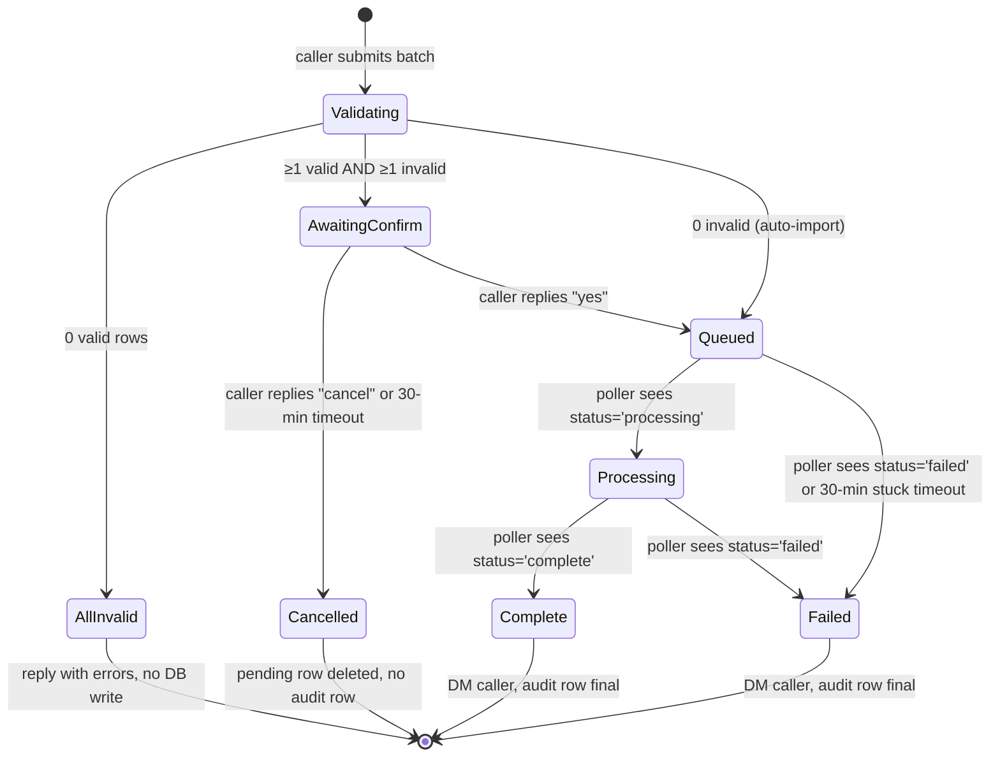
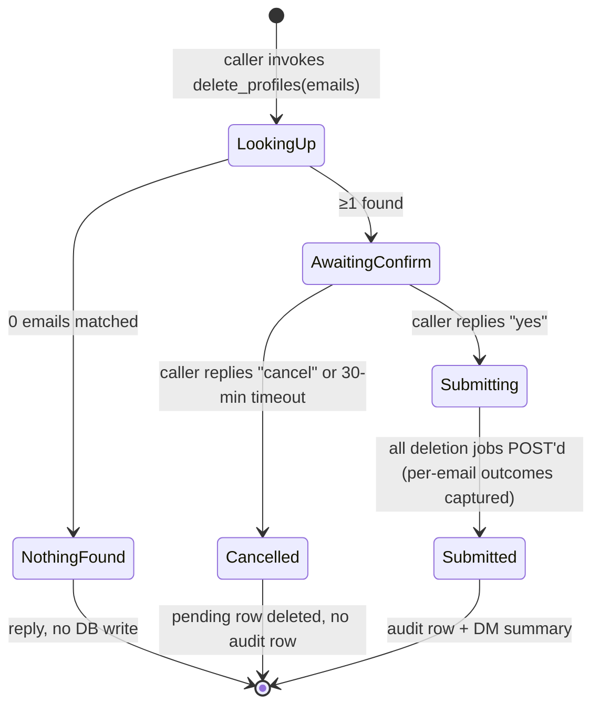

# Klaviyo Profile Management — Import & Delete (with consent + audit) — Design Spec

**Date**: 2026-05-05
**Author**: Danny + Claude
**Status**: Approved — ready for plan
**Document status**: Approved
**Feature status**: Planned
**Owner**: Danny
**Team / Pod**: Functional (gantri-ai-bot)
**Related links**:
- Klaviyo API docs — `POST /api/profile-subscription-bulk-create-jobs`
- Klaviyo API docs — `GET /api/profile-bulk-import-jobs/{id}`
- Klaviyo API docs — `GET /api/profiles?filter=equals(email,"x")`
- Klaviyo API docs — `POST /api/data-privacy-deletion-jobs` (Data Privacy API — async profile deletion)
- Slack API — Events: `file_shared`, `files.info`
- Existing connector pattern: `docs/process/adding-a-connector.md`
- Sibling spec (admin-only tool precedent): `bot.broadcast_notification`, `bot.add_user`
- Sibling spec (Klaviyo client extension precedent): `2026-04-29-klaviyo-consented-signups-design.md`

> **Note on format.** This is a Markdown design spec living next to the rest of the gantri-ai-bot specs (`docs/superpowers/specs/`). It follows the same shape as the Pipedrive and Klaviyo Consented Signups specs in this folder. The headers below cover every section the FLC template requires (Functional, Technical, Testing, Operational, Security, Related Work, Open Questions). No content has been omitted; sections that are out of scope for now are flagged inline.

---

## Functional Specification

### Overview

The marketing team (Lana et al.) cannot manage customer/prospect profiles in Klaviyo without leaving Slack and logging into Klaviyo's UI, resulting in friction every time they need to (a) bulk-add a list (BDNY booth signups, Trade signup-form weekly export, ICFF lead lists, Design Miami contacts) or (b) bulk-remove profiles (e.g., after a vendor list turned out to be junk, or after a privacy/deletion request from a customer). This limitation exists because gantri-ai-bot today exposes only **read** Klaviyo tools (`list_campaigns`, `list_segments`, `campaign_performance`, `flow_performance`, `consented_signups`); there is no write path. The gap forces marketing to either (a) hand-paste profiles into Klaviyo's web upload UI, (b) click-delete one profile at a time, or (c) ask a developer to run an ad-hoc script — all slow, error-prone, and not auditable from inside our normal Slack workflow.

This feature adds two bot-driven Klaviyo write paths, both gated by an `admin`/`marketing` role:

- **Import** — two invocation modes (inline list of ≤20 emails, or CSV attachment in DM). Validates rows, asks the caller to confirm if any rows are invalid (importing the valid subset), creates profiles, subscribes them with consent on the channels the caller specified, and optionally adds them to a list.
- **Delete** — an explicit `klaviyo.delete_profiles` tool that takes a list of emails (≤50 per call), previews which profiles would be removed, and only deletes after the caller confirms.

Both paths leave an audit row in our database tying the operation back to the Slack user who ran it.

### Conceptual

**What it does:** Lets an `admin` or `marketing` user, from inside a Slack DM with the bot, (a) upload a batch of customer profiles to Klaviyo with marketing consent on chosen channels and optional list-membership, or (b) bulk-delete profiles from Klaviyo by email. Both write paths require explicit caller confirmation in any partial / destructive scenario, persist an audit row, and DM the caller with a final summary.

For imports there are two invocation modes: an **inline** path for small batches (≤20 profiles typed into the message) and a **CSV** path (attach a file, bot picks it up via `file_shared`). The bot validates every row; if all rows are valid it imports directly; if any row is invalid it asks the caller whether to import the valid subset and skip the invalid rows.

For deletions there is one mode: an `admin`/`marketing` caller invokes `klaviyo.delete_profiles` with a list of emails (≤50 per call). The bot looks up each email in Klaviyo, previews which profiles would be removed (and which were not found), and only calls Klaviyo's deletion endpoint after the caller replies "yes".

**Glossary:**

| Term | Definition |
|---|---|
| **Profile** | A Klaviyo contact record, keyed by email (and/or phone). Has subscription state per channel (email/sms). Emails are unique per Klaviyo account, so an email lookup returns at most one profile. |
| **Bulk-subscribe job** | Klaviyo's async endpoint (`POST /api/profile-subscription-bulk-create-jobs`) that creates profiles + sets consent + optionally adds to a list. Returns 202 + `job_id`; status is polled separately. Up to ~1000 profiles per job. |
| **Profile-deletion job** | Klaviyo's async Data Privacy endpoint (`POST /api/data-privacy-deletion-jobs`) that schedules a single profile for permanent deletion by `email`, `phone_number`, or `id`. Returns 202; deletion completes asynchronously and the profile then appears on Klaviyo's "Deleted Profiles" page. The endpoint is intended for GDPR/CCPA-style requests. |
| **List** | A static Klaviyo audience (e.g., "Trade Customers"). Profiles can be added during the bulk-subscribe call via `list_id`. Distinct from a *segment* (segments are dynamic queries, not target-able for import). |
| **Consent** | The opt-in state per channel. Klaviyo accepts `SUBSCRIBED`, `UNSUBSCRIBED`, `NEVER_SUBSCRIBED`. For an import, the caller chooses which channels to subscribe (`channels: ['email']` or `['email','sms']`); the chosen channels are set to `SUBSCRIBED` for every row in the batch. The audit row + the operator-trust gate (admin/marketing role) is what evidences consent — we don't require per-row attestation in the CSV. |
| **Channels** | The list of subscription channels to set on each profile in an import. `'email'`, `'sms'`, or both. Default `['email']`. Whole-batch, not per-row. |
| **Inline batch** | Up to 20 profiles passed as a single Slack message — the LLM extracts them and calls the tool with structured args. |
| **CSV batch** | A file (≤1 MB, ≤1000 rows) attached to a DM with the bot. The Slack `file_shared` event triggers a separate handler that downloads, parses, validates, then calls the same tool. |
| **Caller** | The Slack user who triggered the operation. Stored on the audit row as `caller_slack_id`. Must have `role IN ('admin','marketing')` in `authorized_users`. |
| **Marketing role** | A new value in `authorized_users.role` (alongside the existing `'admin'` and `'user'`). Marketing-role users can call `klaviyo.import_profiles` and `klaviyo.delete_profiles`. They CANNOT call `bot.broadcast_notification` or `bot.add_user` — those remain admin-only. |
| **Pending confirmation** | A short-lived row in `pending_confirmations` that holds a validated import payload (or a delete preview) between the bot's "should I proceed?" prompt and the caller's "yes"/"cancel" reply. Looked up by caller + thread on reply. Expires after 30 minutes. |
| **Audit row** | A row in either `klaviyo_imports` or `klaviyo_deletions` that records who did what, when, against which Klaviyo objects, and the final outcome. For imports of CSV origin, the CSV file is also archived. |
| **Consent source** | Free-text string Klaviyo stores as `custom_source` on the profile. Defaults to `"Slack import — <list_name> (<YYYY-MM-DD>)"`. Overridable per-row via the `consent_source` CSV column or whole-batch via the `default_consent_source` arg. This becomes the audit trail for "where did this opt-in come from" if Klaviyo or a regulator asks. |

<!-- USER FLOWS -->

<details>
<summary><strong>User Flow — Inline import, all rows valid</strong></summary>

**Actor:** Admin/marketing user in DM with the bot.

1. Caller types: *"Add to Trade Customers list (email + sms): alice@x.com (Alice Smith, +1 415 555 0100), bob@y.com (Bob Jones, +1 415 555 0123) — consent source: BDNY booth 2026"*.
2. The orchestrator routes to `klaviyo.import_profiles` and extracts structured args: `list` (name or id), `channels` (default `['email']`), `default_consent_source`, per-row `email`, `first_name`, `last_name`, `phone`.
3. The tool (a) checks `caller.role IN ('admin','marketing')`, (b) resolves the list name to an id via the existing list cache, (c) validates every row, (d) finds 0 invalid rows, (e) calls Klaviyo's bulk-subscribe endpoint with all rows on the requested channels, (f) writes a `klaviyo_imports` audit row with `status='queued'` and the count breakdown (`total_submitted=2, total_imported=2, total_invalid_rejected=0`), (g) replies in-thread: *"All 2 rows valid — queued to 'Trade Customers' on email+sms (job `abc123`). I'll DM you when it finishes."*
4. The background poller picks up the audit row on its next tick, polls Klaviyo for job status, and when status flips to `complete` or `failed` updates the audit row and DMs the caller: *"Import complete — 2 of 2 profiles subscribed to 'Trade Customers' on email+sms. (Job `abc123`, took 8s.)"*

</details>

<details>
<summary><strong>User Flow — Inline / CSV import, some rows invalid (caller confirms)</strong></summary>

**Actor:** Admin/marketing user in DM with the bot.

1. Caller submits a batch (inline or CSV) of 312 rows where row 7 has an invalid email and row 12's phone fails E.164 normalization.
2. The tool validates every row, classifies 310 valid + 2 invalid, and instead of importing or refusing, replies with a summary and asks for confirmation: *"Validated 312 rows: 310 valid, 2 invalid. The 2 invalid rows would be skipped:*
   - *Row 7 (gertrude@@gmail.com): invalid email format*
   - *Row 12 (mary@example.com): phone '4o5-555-0100' could not be normalized to E.164*
   *Import the 310 valid rows and skip the 2 invalid? Reply 'yes' to proceed or 'cancel' to abort. (This prompt expires in 30 minutes.)"*
3. The tool persists the validated 310-row payload to `pending_confirmations` keyed by `caller_slack_id + thread_ts`, with `expires_at = now()+30min`. **No Klaviyo call yet. No `klaviyo_imports` row yet.**
4. Caller replies *"yes"* in the same thread within 30 minutes.
5. The orchestrator's confirmation handler looks up the pending row, calls Klaviyo's bulk-subscribe with the 310 valid rows, writes the `klaviyo_imports` audit row with `total_submitted=312, total_imported=310, total_invalid_rejected=2, status='queued'`, deletes the pending row, and replies *"Queued 310 profiles to 'BDNY 2026' (job `xyz789`). I'll DM you when it finishes."*
6. Background polling proceeds normally; final DM reflects the 310 imported (e.g., *"Import complete — 310 of 310 valid profiles subscribed (286 new, 24 already-subscribed). 2 invalid rows skipped at validation time. Job `xyz789`."*).

</details>

<details>
<summary><strong>User Flow — Inline / CSV import, all rows valid (no confirmation needed)</strong></summary>

**Actor:** Admin/marketing user in DM with the bot.

1. Caller submits a batch with 0 invalid rows.
2. The tool imports directly without prompting — same end-state as the "all valid" inline flow above. No `pending_confirmations` row is created.

</details>

<details>
<summary><strong>User Flow — CSV import, validation triggers confirmation</strong></summary>

**Actor:** Admin/marketing user in DM with the bot.

1. Caller drops a CSV file (`bdny-booth-2026.csv`, 312 rows) into the DM with the message *"Import these to BDNY 2026 list, email channel"*.
2. Slack delivers a `file_shared` event to the bot. The handler verifies (a) the channel is a DM (`D…`), (b) the sharer's `authorized_users.role IN ('admin','marketing')`, (c) the file is ≤1 MB and is `text/csv` or has `.csv` extension.
3. The handler downloads the file via `files.info` → `url_private_download` (with `Authorization: Bearer <bot-token>`), parses with `papaparse`, and runs row validation. The list and channels are taken from the message text via the orchestrator (or asked back if ambiguous).
4. If 0 invalid → import directly. If ≥1 invalid → ask for confirmation as above. The CSV is archived to Supabase Storage at the moment of confirmation (not at parse time).

</details>

<details>
<summary><strong>User Flow — Delete profiles by email</strong></summary>

**Actor:** Admin/marketing user in DM with the bot.

1. Caller types: *"Delete these emails from Klaviyo: junk1@example.com, junk2@example.com, junk3@example.com"*.
2. The orchestrator routes to `klaviyo.delete_profiles` with `{ emails: [...] }` (≤50, validated as email format, deduplicated case-insensitively).
3. The tool checks `caller.role IN ('admin','marketing')`, then for each email calls Klaviyo's profile lookup (`GET /api/profiles?filter=equals(email,"...")`) — at most one match per email since emails are unique. Each email is classified `found` (with `profile_id`, `created_at`, optional list-membership info) or `not_found`.
4. The tool persists the validated preview to `pending_confirmations` keyed by `caller_slack_id + thread_ts`, with `expires_at = now()+30min`, and replies: *"Looked up 3 emails — 2 found in Klaviyo, 1 not found:*
   - *junk1@example.com — profile_id `01H...`, created 2024-08-12, on lists ['BDNY 2024']*
   - *junk2@example.com — profile_id `01J...`, created 2025-01-03, on lists ['Trade Prospects']*
   - *junk3@example.com — not found (already deleted or never imported)*
   *Delete 2 profiles permanently? Reply 'yes' to proceed or 'cancel' to abort. This cannot be undone. (Prompt expires in 30 minutes.)"*
5. Caller replies *"yes"*. The confirmation handler looks up the pending row and, for each found profile, calls Klaviyo's `POST /api/data-privacy-deletion-jobs` (one async job per email — Klaviyo's deletion endpoint is single-identifier; we loop). Each call's success/failure is recorded.
6. The handler writes a `klaviyo_deletions` audit row with `requested_emails`, `found_count=2`, `deleted_count`, `failed_count`, `failed_details`, deletes the pending row, and DMs the caller: *"Deletion submitted — 2 of 2 found profiles scheduled for deletion. Klaviyo processes deletion asynchronously and the profiles will appear on its 'Deleted Profiles' page once removed."*

</details>

<!-- FAILURE PATHS -->

<details>
<summary><strong>Failure Path — Caller lacks the admin/marketing role</strong></summary>

**Actor:** User with `role='user'` (or unauthorized) attempting an import or delete.

1. Caller types an inline import command, shares a CSV in DM, or invokes `klaviyo.delete_profiles`.
2. The tool (or the `file_shared` handler) reads the caller's `authorized_users` row and finds `role='user'` (or no row).
3. The bot replies in-thread: *"Sorry — importing or deleting Klaviyo profiles is restricted to users with the `admin` or `marketing` role. Ping Danny to request the marketing role if you need this access."*
4. No Klaviyo call is made. No audit row is written. A warn-level log is emitted (`klaviyo_write_denied caller=U999 action=import|delete reason=role`).

</details>

<details>
<summary><strong>Failure Path — Caller cancels the confirmation prompt</strong></summary>

**Actor:** Admin/marketing user, after the bot has asked for "yes/cancel".

1. Caller replies *"cancel"* (case-insensitive) in the same thread.
2. The orchestrator's confirmation handler looks up the pending row, deletes it, and replies *"OK — cancelled. No profiles were imported / deleted."*
3. **No Klaviyo call is made. No audit row is written.** Only a debug log is emitted (`klaviyo_pending_cancelled caller=U123 action=...`). This is a deliberate choice — the audit table is for actually-executed operations, not for cancelled previews.

</details>

<details>
<summary><strong>Failure Path — Confirmation prompt times out</strong></summary>

**Actor:** Admin/marketing user, who sees the prompt but doesn't reply within 30 minutes.

1. The pending row's `expires_at` passes.
2. A periodic sweep (piggybacked on the existing background runner) deletes expired pending rows. No DM is sent on expiration (avoids inbox noise).
3. If the caller later replies *"yes"* in the same thread, the confirmation handler can't find the pending row and replies *"That confirmation expired. Re-run the command if you still want to proceed."*
4. No Klaviyo call. No audit row.

</details>

<details>
<summary><strong>Failure Path — All rows in a batch are invalid</strong></summary>

**Actor:** Admin/marketing user, inline or CSV.

1. Caller submits a 5-row batch where every row has an invalid email or no phone for SMS.
2. After validation the tool finds 0 valid rows. There is nothing to confirm or import.
3. The bot replies with a numbered error list: *"All 5 rows failed validation — nothing to import:*
   - *Row 1 (gertrude@@gmail.com): invalid email format*
   - *Row 2 (...): ...*
   *Fix the file and re-share."*
4. No `pending_confirmations` row, no `klaviyo_imports` row, no Klaviyo call.

</details>

<details>
<summary><strong>Failure Path — Klaviyo import job comes back <code>failed</code></strong></summary>

**Actor:** Background poller, on behalf of the original caller.

1. The poller calls `GET /api/profile-bulk-import-jobs/<job_id>` and finds `status='failed'`.
2. The `klaviyo_imports` audit row is updated with `status='failed'`, `completed_at=now()`, `error_summary=<top-level error from Klaviyo response>`.
3. The bot DMs the caller: *"Klaviyo import failed for job `abc123`: <reason>. <N>-of-<total> profiles may have been processed before the failure — check Klaviyo for the partial state. Audit id: <uuid>."*
4. The poller does NOT retry automatically. The caller decides whether to re-run.

</details>

<details>
<summary><strong>Failure Path — CSV file is too large or wrong type</strong></summary>

**Actor:** Admin/marketing user.

1. Caller shares a 50 MB Excel file (`.xlsx`) in DM.
2. The `file_shared` handler rejects on size or MIME type before any download / parse.
3. The bot replies: *"That file is too big / not a CSV. Limits: max 1 MB, max 1000 rows, must be a `.csv` file. Export from Excel as CSV and re-share."*
4. No download happens. A warn log (`caller, file_size, mime`) is written.

</details>

<details>
<summary><strong>Failure Path — List name does not resolve</strong></summary>

**Actor:** Admin/marketing user.

1. Caller types *"Add to 'Trade Customrs' list..."* (typo).
2. The tool calls Klaviyo's cached list directory and finds no exact-name match.
3. The bot replies with the closest 5 lists by name and asks the user to confirm: *"No list named 'Trade Customrs' found. Did you mean: 'Trade Customers' (id ABC123), 'Trade Prospects' (id DEF456), … ? Re-send with the exact name or id."*
4. Nothing is written. No Klaviyo write call is made.

</details>

<details>
<summary><strong>Failure Path — Delete: every email is not_found</strong></summary>

**Actor:** Admin/marketing user attempting `klaviyo.delete_profiles`.

1. Caller submits 5 emails. All 5 lookups return no profile.
2. The tool replies *"Looked up 5 emails, none found in Klaviyo. Nothing to delete."*
3. No `pending_confirmations` row, no `klaviyo_deletions` row, no Klaviyo write call.

</details>

<details>
<summary><strong>Failure Path — Delete: Klaviyo deletion job submission fails for one email</strong></summary>

**Actor:** Confirmation handler for `klaviyo.delete_profiles`, after caller said "yes".

1. Of N found profiles, M-1 deletion-job POSTs succeed (202) and 1 returns 4xx/5xx.
2. The handler captures the failed email + status + error body in `failed_details`, continues with the rest, writes the audit row with `deleted_count=M-1, failed_count=1`, and DMs: *"Deletion submitted — (M-1) of M succeeded, 1 failed:* `*<email>* — `<status>`: `<error>`*. Re-run with that email if needed. Audit id: <uuid>."*

</details>

**State Transitions — Import:**



**State Transitions — Delete:**



**Status descriptions** (visible in audit row + DM):

Import (`klaviyo_imports.status`):
- **Queued** — Klaviyo accepted the bulk-subscribe job; awaiting first poll.
- **Processing** — Klaviyo is working through the batch.
- **Complete** — Klaviyo confirms success.
- **Failed** — Klaviyo confirms failure (or polling exceeded retry budget / 30-min stuck timeout).

Delete (`klaviyo_deletions.status`):
- **Submitted** — All per-email deletion-job POSTs to Klaviyo have completed (the deletion itself runs async on Klaviyo's side; we capture submission outcomes only). The audit row's `deleted_count` is the number of successful submissions, `failed_count` is the number of submission failures.

Internal-only states (never persisted to DB):
- **Validating / LookingUp** — between message receipt and DB write.
- **AllInvalid / NothingFound** — early exit before any DB write.
- **AwaitingConfirm** — held in `pending_confirmations` (separate table), not in `klaviyo_imports` / `klaviyo_deletions`.
- **Cancelled** — pending row deleted; no audit row created.

**Mockups & Screenshots**

<details>
<summary>Mockups & Screenshots — placeholder</summary>

> To be added — Slack DM screenshots of (a) inline import success DM, (b) "validated 312 rows, 2 invalid — yes/cancel?" confirmation prompt, (c) delete preview prompt, (d) per-row completion DM. There is no separate Figma source for this — the surface is plain Slack DM messages, not custom UI.

</details>

**Validation & confirmation flow:**

The bot is **lenient on partial validity** and **strict on partial deletion**. Concretely:

- **Imports** never reject a whole batch just because some rows are invalid. They classify rows, and:
  - 0 invalid → import directly, no confirmation needed.
  - ≥1 invalid AND ≥1 valid → reply with the per-row error list (capped at the first 20 errors for readability; if there are >20, show the first 20 plus *"… and N more"*) and ask *"Import the K valid rows and skip the M invalid? Reply 'yes' to proceed or 'cancel' to abort."* The validated K-row payload is staged in `pending_confirmations` for 30 minutes.
  - 0 valid → reply with the error list, do not ask, do not import.
- **Deletes** always confirm before any destructive call, even if every email was found and looks fine. The preview lists per-email lookup status (`found` with `profile_id` + `created_at` + lists, or `not_found`) and asks *"Delete N profiles permanently? Reply 'yes' to proceed or 'cancel' to abort. This cannot be undone."*
- The `pending_confirmations` table holds the validated payload between the prompt and the reply. Lookup key on reply: `(caller_slack_id, channel_id, thread_ts)`. Each pending row carries `confirmation_token` (uuid, embedded invisibly in the bot's prompt for traceability), `caller_slack_id`, `channel_id`, `thread_ts`, `kind` (`'import'`|`'delete'`), `payload` (jsonb), `created_at`, `expires_at`. Rows older than `expires_at` are reaped on the background tick.
- "yes" / "cancel" matching is case-insensitive, trimmed, exact-string match. Anything else in the same thread is ignored (the LLM may also chime in, but the confirmation handler runs first and consumes the message before the orchestrator dispatches).

**List resolution rules:**

- The tool accepts `list` as either a Klaviyo list id (regex `^[A-Za-z0-9]{6,}$`) OR a case-insensitive exact list name. If the input matches the id regex, it is treated as an id and validated against the cached list directory. Otherwise it is resolved by name.
- Name resolution is case-insensitive and trims whitespace, but does NOT do fuzzy matching automatically — typos return the "did you mean…" failure path above. Reasoning: a fuzzy auto-match could silently import to the wrong list.
- The list directory is fetched once per process and refreshed on TTL (10 min, same pattern as Pipedrive's directory cache). A cache miss triggers a refresh; if Klaviyo is down, the import fails with a clear error.
- `list_id` is **optional**. If omitted, the bulk-subscribe call still creates + subscribes the profiles globally, but does not add them to any list.

**Consent semantics:**

- The caller specifies subscription channels at the **batch level** via the `channels` arg: `['email']` (default), `['sms']`, or `['email','sms']`. The chosen channels are set to `SUBSCRIBED` for every row in the batch. The CSV does NOT need `consent_email` / `consent_sms` columns.
- The required CSV column is `email`. Optional columns: `first_name`, `last_name`, `phone`, `consent_source`. (Legacy per-row `consent_email`/`consent_sms` columns, if present, are ignored with a warning in the bot's reply.)
- Operator trust + audit row is the compliance posture. The premise: the people who can hit this tool (`admin` or `marketing` role) are people we trust not to upload purchased lists. The audit row records which Slack user submitted which payload, against which list, on which date — sufficient to investigate and remediate after the fact if a complaint surfaces. Per-row consent attestation in the CSV does not actually add legal protection beyond this (the operator is still the one attesting), but it adds friction every time. We choose less friction.
- **If `channels` includes `'sms'`, every row must have a phone that normalizes to E.164.** A row missing a phone is an *invalid row*, classified during validation and surfaced in the confirmation prompt.
- `consented_at` defaults to "now" but can be overridden per row (useful for "BDNY booth, signed Apr 30") via the CSV column. Must be ISO 8601.
- `consent_source` defaults to `default_consent_source` (per import) which itself defaults to `"Slack import — <list_name> (<YYYY-MM-DD>)"`. Overridable per row via the optional CSV column.

**Duplicate handling:**

- **Within a batch**: if the same email appears twice in the input (case-insensitive), the second occurrence is classified as *invalid* with reason *"duplicate of row M"*. (Same classification mechanism as any other invalid row — surfaces in the confirmation prompt, valid rows still proceed if caller says yes.)
- **Already-subscribed profiles**: Klaviyo's bulk-subscribe is idempotent for already-subscribed profiles — it returns success, does NOT change consent timestamps, and does NOT spam the user. We surface this in the per-row outcome (`already_subscribed`) so the caller knows.
- **Already-existing-but-not-subscribed**: Klaviyo creates the subscription. Profile stays the same; consent flips to `SUBSCRIBED`.
- **In delete previews**: `emails` arg is deduplicated case-insensitively before lookup. Repeated emails are silently collapsed (no need to surface as an error).

**Phone normalization:**

- Phones in the input are best-effort normalized to E.164 with `libphonenumber-js`. Default region: US.
- A phone that fails to normalize is an invalid row with reason *"phone 'xxx' could not be normalized to E.164"* — surfaces in the confirmation prompt.
- If the batch's `channels` includes `'sms'` and a row has no phone (or a phone that fails to normalize), that row is invalid.

**Rate limit handling:**

- Klaviyo's bulk-subscribe endpoint allows 75/s, 750/min. A single import is one POST.
- Klaviyo's profile lookup (`GET /api/profiles`) shares the same 75/s, 750/min bucket. A delete preview of 50 emails uses 50 GETs, well under burst.
- Klaviyo's data-privacy-deletion-jobs endpoint allows **3/s, 60/min**. This is the binding constraint for delete confirmation: deleting 50 profiles means 50 POSTs at ≤3/s, so ~17 seconds minimum. The handler paces submissions at ≤2/s to leave headroom.
- The poller adds one `GET` per `klaviyo_imports` row per minute, capped at 50 rows in flight (see Operational).
- On 429: import POST and lookup GETs retry once with exponential backoff (1s, 2s) — same pattern as Pipedrive client. After two retries the operation returns the error. Deletion-job POSTs treat 429 as "back off 5s, retry once, then mark that email as failed in `failed_details`".

### Security & Access Control

**Role hierarchy.** `authorized_users.role` accepts three values: `'admin'`, `'marketing'`, `'user'`. They are NOT hierarchical (marketing does NOT inherit admin powers); each tool gates against the explicit set of roles allowed.

| Role | `klaviyo.import_profiles` | `klaviyo.delete_profiles` | `klaviyo.import_status` | Drop CSV in DM (import) | `bot.broadcast_notification` | `bot.add_user` / `bot.update_user_role` | All read-only Klaviyo / Northbeam / GA4 / etc. tools |
|---|---|---|---|---|---|---|---|
| `admin` | Yes | Yes | Yes | Yes | Yes | Yes | Yes |
| `marketing` | Yes | Yes | Yes | Yes | **No** | **No** | Yes |
| `user` | No | No | Yes (if whitelisted to Live Reports — see Q7) | No | No | No | Yes |
| Unauthenticated | No (request never reaches the bot — Slack-app allowlist gates this) | No | No | No | No | No | No |

**Authentication requirements:** Same as the rest of the bot — Slack request signing on inbound events (`X-Slack-Signature` HMAC verification, already enforced upstream of the orchestrator), then `authorized_users` lookup by `slack_user_id` to determine role. No new auth surface introduced.

**Data classifications:**

- **PII (high)** — emails, phone numbers, first/last name, Klaviyo `profile_id`. Stored in:
  - Klaviyo (the destination, by design).
  - `klaviyo_imports.error_summary` only when Klaviyo returns per-profile error detail. Truncated to 4 KB. Not a primary store of PII.
  - `klaviyo_deletions.requested_emails` (jsonb) and `klaviyo_deletions.failed_details` (jsonb of `{email, status, error}`). Required to know who was targeted.
  - `pending_confirmations.payload` (jsonb) — short-lived (≤30 min). Validated import payload or delete preview. Reaped on expiration.
  - The archived CSV in Supabase Storage (bucket `klaviyo-imports`, retention 90 days, see below). PII at rest.
- **Consent metadata (high)** — `consented_at`, `consent_source`, batch-level `channels`. Stored on the Klaviyo profile (`custom_source` + `consented_at`) and on the audit row + archived CSV. Required for CASL / CAN-SPAM compliance audits.
- **Operator metadata (medium)** — `caller_slack_id`, `caller_email`. Stored on the audit rows. Same sensitivity as the existing `feedback_reports` table.

**Audit logging:**

| Action | Log level / prefix | Sample query | Retention |
|---|---|---|---|
| Import tool invoked (inline path) | `INFO klaviyo_import_started` | `klaviyo_import_started caller=U123 source=inline list=ABC123 channels=email,sms total_submitted=5` | Pino structured logs (Fly tail), 30 days |
| Import tool invoked (CSV path) | `INFO klaviyo_import_started` | `klaviyo_import_started caller=U123 source=csv filename=bdny.csv channels=email total_submitted=312` | 30 days |
| Import — confirmation requested (partial) | `INFO klaviyo_import_pending` | `klaviyo_import_pending caller=U123 valid=310 invalid=2 token=<uuid>` | 30 days |
| Import — caller confirmed | `INFO klaviyo_import_confirmed` | `klaviyo_import_confirmed caller=U123 token=<uuid>` | 30 days |
| Import — caller cancelled | `DEBUG klaviyo_pending_cancelled` | `klaviyo_pending_cancelled caller=U123 token=<uuid> action=import` | 30 days |
| Import — pending expired | `DEBUG klaviyo_pending_expired` | `klaviyo_pending_expired token=<uuid> action=import age_min=31` | 30 days |
| Import — all rows invalid | `WARN klaviyo_import_all_invalid` | `klaviyo_import_all_invalid caller=U123 invalid=5 total=5` | 30 days |
| Klaviyo job queued | `INFO klaviyo_import_queued` | `klaviyo_import_queued caller=U123 job_id=abc123 audit_id=<uuid> imported=310 invalid_skipped=2` | 30 days |
| Job completed (poller) | `INFO klaviyo_import_completed` | `klaviyo_import_completed audit_id=<uuid> job_id=abc123 imported=310 succeeded=286 already_subscribed=24 failed=0 duration_ms=27000` | 30 days |
| Job failed (poller) | `ERROR klaviyo_import_failed` | `klaviyo_import_failed audit_id=<uuid> job_id=abc123 error="<klaviyo top-level error>"` | 30 days + error reporting (alerting hook) |
| Delete tool invoked | `INFO klaviyo_delete_started` | `klaviyo_delete_started caller=U123 emails_count=5` | 30 days |
| Delete — preview requested | `INFO klaviyo_delete_pending` | `klaviyo_delete_pending caller=U123 found=2 not_found=3 token=<uuid>` | 30 days |
| Delete — caller confirmed | `INFO klaviyo_delete_confirmed` | `klaviyo_delete_confirmed caller=U123 token=<uuid>` | 30 days |
| Delete — submission complete | `INFO klaviyo_delete_submitted` | `klaviyo_delete_submitted audit_id=<uuid> deleted=2 failed=0 duration_ms=4200` | 30 days + error reporting if `failed>0` |
| Permission denied (any write tool) | `WARN klaviyo_write_denied` | `klaviyo_write_denied caller=U999 action=import|delete reason=role` | 30 days |

The structured `audit_id` (UUID) is the join key between logs and the `klaviyo_imports` / `klaviyo_deletions` tables.

**Retention and deletion policy:**

- `klaviyo_imports` rows: **kept indefinitely**. Required for opt-in proof under CASL / CAN-SPAM. Soft-delete only via a future admin tool; no automatic purge.
- `klaviyo_deletions` rows: **kept indefinitely**. Required to evidence GDPR/CCPA-style deletion requests we acted on. Soft-delete only via a future admin tool.
- `pending_confirmations` rows: **30-minute TTL**, reaped by a periodic sweep on the existing background runner. No long-term storage of validated payloads.
- Archived CSV files in Supabase Storage: **90 days**. Long enough for a "did this batch include person X?" audit; short enough that we don't accumulate PII. After 90 days, only the row metadata remains (caller, list, total counts, job id).
- If a person requests deletion (GDPR-style), the **profile** is deleted from Klaviyo via `klaviyo.delete_profiles` (this feature). Any matching CSV files in Supabase Storage are also purged via a manual admin operation. The audit row itself is retained but `caller_email` / per-row PII fields can be blanked on request — manual operation in v1.
- On bot deactivation (the whole app sunsets), the tables and bucket survive in Supabase until explicitly dropped.

**Rate limiting:**

- **Per caller — imports**: max 5 import jobs in flight at once (`klaviyo_imports.status` in `queued`/`processing`). 6th attempt returns *"You already have 5 imports in flight — wait for one to finish."*
- **Per caller per hour — imports**: max 20 import attempts (counts every invocation including ones that ended in `Cancelled`/`AllInvalid`). Returns *"Rate-limited — 20 import attempts in the last hour. Try again in <X> minutes."*
- **Per caller per hour — deletes**: max 5 delete invocations (each invocation can target up to 50 emails, so 250 deletions/hour cap). Returns *"Rate-limited — 5 delete attempts in the last hour."*
- **Per caller — pending confirmations**: max 3 outstanding pending confirmations at any time. Prevents the table from filling up if someone repeatedly triggers prompts and never replies. 4th attempt returns *"You already have 3 unanswered confirmation prompts — answer or cancel one before starting another."*
- **Profile count per single import**:
  - Inline: max 20 profiles. Hard-coded; the orchestrator instructs the LLM to refuse anything larger.
  - CSV: max 1000 profiles per file (one Klaviyo bulk-subscribe job is 1000 max). v1 hard-fails CSVs >1000 with *"Split this into smaller files for now."* Auto-chunking deferred to v2.
- **Email count per single delete**: max 50 per call (Klaviyo deletion is 3/s and one deletion per email; 50 keeps the user-facing operation under ~30s).
- **CSV file size**: max 1 MB per file. Files larger are rejected at `file_shared` time, no download.

**Threat considerations:**

- **Consent fraud (operator-level)**: a malicious admin/marketing user uploads emails the company hasn't actually obtained consent for. **Mitigation**: admin/marketing-only gate (small set of trusted users); the audit row + archived CSV record exactly what they uploaded so we can investigate after the fact. The premise (per Danny) is that nobody authorized for this role uploads purchased lists; if that premise breaks, we revoke the role and replay the audit table.
- **Permanent data loss (delete tool)**: a malicious or fat-fingered caller submits the wrong list of emails and confirms. Klaviyo's deletion is permanent and asynchronous — once the deletion job completes the profile is gone (along with its event history) and we cannot recover it from Klaviyo. **Mitigation**: (1) mandatory two-step yes/cancel confirmation showing per-email lookup detail (created_at, lists) so the caller sees what they're about to delete, (2) audit row records `requested_emails` so we can recreate the targeted profiles via the import tool if needed (recreated profile would lose the original `created_at` and event history, but at least the email is back in Klaviyo), (3) admin/marketing role gate restricts who can call it, (4) per-call cap of 50 emails limits blast radius.
- **Wrong-list import (fat-finger)**: caller types "Trade Customers" but means "Trade Prospects". **Mitigation**: list-name resolution is exact-match only (no fuzzy auto-match), and the bot echoes back the resolved list name + id in the queued message. If it's wrong, the caller has the audit-id in hand to either (a) use `klaviyo.delete_profiles` on the imported emails (audit row tracks all of them), or (b) ask Klaviyo to roll back via UI.
- **Malicious CSV content (CSV injection)**: a row contains `=cmd|...` (Excel formula injection). **Mitigation**: we only ever read column values as strings. We never write the values into a spreadsheet, render them as HTML, or pass them to a shell. The values land in Klaviyo (as profile fields) and in our DB (as text). Low risk.
- **Slack file URL leak**: the `url_private_download` URL is short-lived but does include a token. **Mitigation**: we never log it. We download once with the bot token, parse, then discard the URL.
- **DoS via large file or repeated prompts**: 100 MB file, repeated 100 times; or 100 confirmation prompts opened and never answered. **Mitigation**: size cap (1 MB) + per-caller rate limits (20 imports/hr, 5 deletes/hr) + max-in-flight imports (5) + max-pending-confirmations per caller (3) + 30-min auto-reap on `pending_confirmations`.
- **Confirmation hijack across sessions**: caller A's "yes" reply being matched to caller B's pending row. **Mitigation**: pending lookup is keyed on `(caller_slack_id, channel_id, thread_ts)` — it's impossible for caller B's reply to land in caller A's thread because Slack threads are per-message.
- **Scope creep on the Klaviyo API key**: same key used for read tools is used for write + delete. **Mitigation**: confirm during review that the key has `lists:write`, `profiles:write`, `subscriptions:write`, AND `data-privacy:write` (the last is required by the deletion endpoint — see Open Questions Q6). If not, rotate the key with the broader scope. Document the new scope set in `reference_gantri_ai_bot_deploy.md`.

### Requirements

| ID | Requirement |
|---|---|
| R1 | When a caller with `role IN ('admin','marketing')` sends an inline import command in a bot DM, the system validates every row and classifies each as valid or invalid. If 0 invalid, it imports all rows directly. If ≥1 invalid AND ≥1 valid, it stages the validated payload in `pending_confirmations` and replies with a per-row error summary asking *"Import the K valid and skip the M invalid? Reply 'yes' or 'cancel'."* No Klaviyo call is made until the caller replies "yes". |
| R2 | When a caller with `role IN ('admin','marketing')` shares a CSV file in a DM, the system downloads the file via `files.info`, parses it with `papaparse`, and applies the same validate-and-confirm-or-import behavior as the inline path. The required CSV column is `email`; `consent_email` / `consent_sms` columns are no longer used. |
| R3 | When a caller without `role IN ('admin','marketing')` attempts an import, a delete, or shares a CSV in DM, the system replies with a permission-denied message (no Klaviyo call, no audit row, no pending row), and emits a `klaviyo_write_denied` warn log with the caller id and action. |
| R4 | Every executed import (after caller confirmation, or after auto-import when 0 invalid) writes exactly one row to `klaviyo_imports` with `caller_slack_id`, `caller_email`, `source` (`inline`\|`csv`), `filename` (csv only), `storage_path` (csv only), `list_id`, `list_name`, `channels`, `total_submitted`, `total_imported`, `total_invalid_rejected`, `klaviyo_job_id`, `status='queued'`, `started_at`. Cancelled or all-invalid imports do NOT write a row. |
| R5 | A background poller (the existing `ReportsRunner` cadence, or a sibling) checks every `queued`/`processing` `klaviyo_imports` row at most once per minute, updates `status` and `completed_at` when Klaviyo reports terminal state, and DMs the original caller with a per-row outcome summary. |
| R6 | When a caller with `role IN ('admin','marketing')` invokes `klaviyo.delete_profiles` with a list of emails (≤50, validated as email format, deduplicated), the system looks up each email in Klaviyo via `GET /api/profiles?filter=equals(email,"...")`, builds a per-email preview (`found` with `profile_id`/`created_at`/lists, or `not_found`), stages it in `pending_confirmations`, and replies with the preview asking *"Delete N profiles permanently? Reply 'yes' or 'cancel'."* No Klaviyo deletion call is made until the caller replies "yes". |
| R7 | When the caller confirms a delete, the system calls `POST /api/data-privacy-deletion-jobs` once per found email (paced ≤2/s to stay under Klaviyo's 3/s burst limit), captures per-email submission outcome (HTTP status, error body), writes one `klaviyo_deletions` audit row with `caller_slack_id`, `requested_emails`, `found_count`, `deleted_count`, `failed_count`, `failed_details`, `started_at`, `completed_at`, `status='submitted'`, and DMs the caller a summary. |
| R8 | When the caller cancels (`"cancel"`) a pending import or delete confirmation, or the prompt expires after 30 minutes, no Klaviyo write call is made and no audit row is written. The `pending_confirmations` row is deleted. |
| R9 | A list specified by name is resolved against Klaviyo's cached list directory (case-insensitive exact match). Unknown list names return a "did you mean…" failure with up to 5 closest matches and do NOT call the bulk-subscribe endpoint. |
| R10 | A duplicate email within a single import batch (case-insensitive) is classified as an invalid row with reason *"duplicate of row M"*. The valid rows still proceed if the caller confirms. |
| R11 | Phones are normalized to E.164 (default region US) using `libphonenumber-js`. Failure to normalize classifies the row as invalid. If the import's `channels` includes `'sms'`, a row missing a phone is invalid. |
| R12 | The import's batch-level `channels` arg controls which channels are set to `SUBSCRIBED` for every row. Default `['email']`. Allowed values: `['email']`, `['sms']`, `['email','sms']`. The CSV does not need per-row consent columns. |
| R13 | Per-caller rate limits enforce: max 5 in-flight imports; max 20 import attempts per hour; max 5 delete attempts per hour; max 3 outstanding pending confirmations; max 20 profiles per inline import; max 1000 profiles per CSV (v1); max 50 emails per delete; max 1 MB per CSV file. Each limit returns a clear reason when exceeded. |
| R14 | A failed Klaviyo import job (`status='failed'`) updates the audit row to `failed` with `error_summary`, DMs the caller the failure reason and audit id, and does NOT auto-retry. |
| R15 | The CSV file (if any) is archived to Supabase Storage bucket `klaviyo-imports/<audit_id>.csv` with 90-day TTL **only after the import is confirmed and the audit row is written**. Cancelled imports leave no archived CSV. The audit row records the storage path. |
| R16 | New role value `'marketing'` is added to `authorized_users.role` (alongside existing `'admin'` and `'user'`). `bot.add_user` accepts an optional `role?: 'admin'|'marketing'|'user'` arg (default `'user'`); a sibling tool `bot.update_user_role` lets an admin change an existing user's role. Both `bot.add_user` and `bot.update_user_role` remain admin-only. |

### Assumptions

| ID | Assumption (already true, not built here) |
|---|---|
| A1 | The existing Klaviyo API key has — or can be rotated to have — the scopes `lists:write`, `profiles:write`, `subscriptions:write`, AND `data-privacy:write` (the last is required by the deletion endpoint). To verify pre-implementation; gating the merge. |
| A2 | The Slack app already receives inbound events to the existing endpoint and has request-signing verification in place. We add `files:read` to the scope list (manual change in api.slack.com). |
| A3 | `authorized_users.role` is already in production from the broadcast/add_user feature with values `'user'` and `'admin'`. This feature ALTERs the column to also accept `'marketing'`; existing rows are unchanged. |
| A4 | The bot has a Supabase Storage bucket (or can create one) at `klaviyo-imports`. If not, the migration creates it. |
| A5 | The orchestrator's existing `ActorContext` (caller's slack id, email, role) is passed into every tool call — same pattern as `bot.broadcast_notification`. |
| A6 | Klaviyo's bulk-subscribe endpoint accepts up to ~1000 profiles per call, returns 202+`job_id`, with status polled at `GET /api/profile-bulk-import-jobs/{id}`. Verified against `revision: 2026-04-15`. |
| A7 | Klaviyo's profile lookup `GET /api/profiles?filter=equals(email,"x")` returns at most one profile per email (emails are unique within a Klaviyo account), shares the standard 75/s, 750/min rate-limit bucket. Verified against `revision: 2026-04-15`. |
| A8 | Klaviyo's `POST /api/data-privacy-deletion-jobs` accepts a single identifier (`email`, `phone_number`, or `id`) per call, returns 202 (async), permanently deletes the profile (showing it on the "Deleted Profiles" page once async processing completes), and is rate-limited 3/s burst, 60/min steady. There is no bulk-delete endpoint as of `revision: 2026-04-15`. |
| A9 | The existing `ReportsRunner` background loop runs at a cadence ≤1 min and can host another job runner alongside it (or we add a sibling `KlaviyoImportPollerJob` running on the same schedule). It also has a hook point for a periodic sweep of `pending_confirmations` expiry. |
| A10 | Marketing write operations are bursty but small in absolute volume — < 50 imports/week, < 10K profiles/week, < 5 deletes/week, < 250 deleted emails/week. Orders-of-magnitude headroom under any Klaviyo rate limit. |

### Exclusions

| ID | Not doing | Why |
|---|---|---|
| E1 | Updating existing-profile properties (first_name, address, segments) beyond consent. | Out of scope — this tool is "create + subscribe", not "edit". A separate `klaviyo.update_profile` tool can be added later if marketing asks. |
| E2 | Unsubscribe / opt-out operations (vs. delete). | Legal sensitivity is the inverse of import; flipping consent is best done through Klaviyo's own UI for now. Delete is in scope; soft-unsubscribe is not. |
| E3 | List creation / deletion / renaming. | Marketing creates lists in Klaviyo's UI. We resolve them, we don't manage them. |
| E4 | Removing or downgrading consent on existing profiles (vs. deleting them outright). | Soft consent changes are out of scope. The delete path covers the destructive case. |
| E5 | SMS-only imports (no email column). | v1 requires `email` per row (Klaviyo's profile primary key). SMS-only is a follow-up if needed. |
| E6 | CSVs >1000 rows / auto-chunking. | Klaviyo's single-job cap is 1000. Auto-chunking adds complexity (multi-job tracking, partial failure semantics). Defer to v2 (per Q8). |
| E7 | Non-CSV file types (XLSX, TSV, JSON). | CSV covers all current use cases (Trade form export, BDNY signups, ICFF list). Adding parsers for more types adds attack surface and maintenance for marginal value. |
| E8 | Webhook-based job-status notifications from Klaviyo. | Polling on a 1-min cadence is simpler and good enough for a tool with a few imports per week. No need to expose a webhook endpoint. |
| E9 | A web UI for reviewing past imports / deletions. | The audit data is in `klaviyo_imports` and `klaviyo_deletions` — Lana queries it via the bot or via SQL if needed. |
| E10 | Multi-tenant Klaviyo (multiple stores). | Single-tenant, like the rest of the bot. |
| E11 | 60-second "undo" grace period after import / delete. | A grace-period cancel adds significant complexity (a `cancelled` status, a Slack action button, a Klaviyo job-cancellation call if available, and for delete: there's no public "undelete" endpoint). The yes/cancel confirmation prompt already gives the caller a guarded checkpoint. Defer to v2 (per Q10). |
| E12 | Per-row consent attestation in the CSV. | Replaced by batch-level `channels` arg + admin/marketing operator-trust + audit row. (Per Danny's review: "nadie va a subir listas compradas".) |
| E13 | Bulk profile deletion via a single Klaviyo endpoint. | Klaviyo's deletion endpoint is single-identifier-per-call. We loop, paced under the 3/s rate limit. If Klaviyo ships a bulk variant later, swap in the loop. |
| E14 | Polling Klaviyo for confirmation that an async deletion job has completed. | The bot reports "submitted", not "deleted". The submission outcome (HTTP 202) is what we audit. The actual purge happens asynchronously on Klaviyo's side and surfaces on Klaviyo's "Deleted Profiles" page; following up via API would require additional endpoints and adds little value. |

---

## Technical Specification

### Architecture

```
┌────────────────────────────────────────────────────────────────────────┐
│  Slack DM (admin/marketing)                                            │
│   1) Inline import: "import to <list>: alice@x.com, bob@y.com..."      │
│   2) CSV file_shared event: file dropped in DM                         │
│   3) Inline delete: "delete from Klaviyo: junk1@..., junk2@..."        │
│   4) Confirmation reply: "yes" / "cancel" in same thread               │
└─────────────────┬───────────────────────────┬──────────────────────────┘
                  │                           │
       ┌──────────┴──────────┐                │
       ▼                     ▼                ▼
┌────────────────────┐ ┌────────────────────┐ ┌────────────────────────┐
│  message_event     │ │  file_shared_event │ │ ConfirmationHandler    │
│  (existing)        │ │  (NEW)             │ │ (NEW — runs BEFORE LLM │
│                    │ │  - verify DM       │ │  dispatch on yes/cancel│
│                    │ │  - verify role     │ │  in a thread that has  │
│                    │ │    in admin/mkt    │ │  a pending row)        │
│                    │ │  - size + MIME     │ │                        │
│                    │ │  - download file   │ │                        │
│                    │ │  - parse CSV       │ │                        │
│                    │ └─────────┬──────────┘ └──────────┬─────────────┘
│                    │           │                       │
└────┬───────────────┘           │                       │
     │ tool args                 │ tool args             │ confirmation_token,
     ▼                           ▼                       │ kind, caller, payload
┌───────────────────────────────────────────────────────────────────────────┐
│  Orchestrator → KlaviyoConnector                                          │
│                                                                           │
│  ┌─────────────────────────────────────────────────────────────────────┐  │
│  │ tool: klaviyo.import_profiles                                       │  │
│  │  - role gate (admin OR marketing)                                   │  │
│  │  - rate-limit (in-flight, per-hour, pending-count)                  │  │
│  │  - row validation → classify valid / invalid                        │  │
│  │  - list resolve (name → id) via cached list directory               │  │
│  │  - 0 invalid → call client.bulkSubscribeProfiles, write             │  │
│  │    klaviyo_imports row (status='queued')                            │  │
│  │  - ≥1 invalid → write pending_confirmations row, return prompt      │  │
│  └─────────────────────────────────────────────────────────────────────┘  │
│                                                                           │
│  ┌─────────────────────────────────────────────────────────────────────┐  │
│  │ tool: klaviyo.delete_profiles                                       │  │
│  │  - role gate (admin OR marketing)                                   │  │
│  │  - rate-limit (per-hour, pending-count)                             │  │
│  │  - per-email lookup via client.findProfileByEmail                   │  │
│  │  - write pending_confirmations row (always — delete always confirms)│  │
│  │  - return preview prompt                                            │  │
│  └─────────────────────────────────────────────────────────────────────┘  │
│                                                                           │
│  ┌─────────────────────────────────────────────────────────────────────┐  │
│  │ tool: klaviyo.import_status (read-only)                             │  │
│  │  - lookup audit row by audit_id or job_id                           │  │
│  └─────────────────────────────────────────────────────────────────────┘  │
│                                                                           │
│  ┌─────────────────────────────────────────────────────────────────────┐  │
│  │ ConfirmationHandler.execute(token, decision)                        │  │
│  │  - decision='yes', kind='import':                                   │  │
│  │      call client.bulkSubscribeProfiles + write klaviyo_imports row  │  │
│  │      + archive CSV (if any) + delete pending row                    │  │
│  │  - decision='yes', kind='delete':                                   │  │
│  │      loop client.deleteProfile(profile_id) at ≤2/s, capture         │  │
│  │      outcomes, write klaviyo_deletions row, delete pending row      │  │
│  │  - decision='cancel': delete pending row, no audit row              │  │
│  └─────────────────────────────────────────────────────────────────────┘  │
└─────────────────────┬─────────────────────────────────────────────────────┘
                      │
                      ▼
┌───────────────────────────────────────────────────────────────────────────┐
│  KlaviyoApiClient (existing — extended)                                   │
│   + bulkSubscribeProfiles(opts) → { job_id }                              │
│     POST /api/profile-subscription-bulk-create-jobs                       │
│   + getBulkImportJobStatus(jobId) → { status, errors? }                   │
│     GET  /api/profile-bulk-import-jobs/{id}                               │
│   + findProfileByEmail(email) → { id, created_at, lists } | null          │
│     GET  /api/profiles?filter=equals(email,"x")&include=lists             │
│   + requestProfileDeletion({ email | profile_id }) → { job_id }           │
│     POST /api/data-privacy-deletion-jobs                                  │
└───────────────────────────────────────────────────────────────────────────┘

   Background:
┌───────────────────────────────────────────────────────────────────────────┐
│  KlaviyoImportPollerJob (NEW — modeled on ReportsRunner)                  │
│   - every 60s:                                                            │
│     • SELECT * FROM klaviyo_imports                                       │
│       WHERE status IN ('queued','processing') LIMIT 50                    │
│       → for each: client.getBulkImportJobStatus(job_id)                   │
│       → terminal status: update row + DM caller via SlackDelivery         │
│     • DELETE FROM pending_confirmations WHERE expires_at < now()          │
└───────────────────────────────────────────────────────────────────────────┘
```

**Boundaries:**

- **Slack handler** owns transport: message receipt, file download, role check, file→tool-arg adaptation. Knows nothing about Klaviyo.
- **ConfirmationHandler** owns confirmation routing: detects "yes"/"cancel" in a thread that has a pending row, dispatches to the appropriate executor (import or delete), and runs BEFORE the LLM orchestrator gets the message (so the LLM doesn't try to interpret "yes" as a fresh request).
- **Tool (`klaviyo.import_profiles`)** owns import business logic: validation, dedup, list resolution, audit-row persistence, Klaviyo POST. Knows nothing about Slack file URLs.
- **Tool (`klaviyo.delete_profiles`)** owns delete business logic: per-email lookup, preview construction, pending-row persistence. Does not call the Klaviyo deletion endpoint — that runs in the confirmation executor.
- **Client** owns HTTP only: builds the JSON:API body, sets headers, parses the response. No validation, no business rules, no DB access.
- **Repos** own DB I/O: `KlaviyoImportsRepo`, `KlaviyoDeletionsRepo`, `PendingConfirmationsRepo`. Mirrors the shape of `KlaviyoSignupRollupRepo`.
- **Poller job** owns polling cadence + DM delivery + pending-row TTL sweep. Single source of truth for "this audit row is now done" and "this stale pending row should die".

### Data Model

**Schema choice — two audit tables, not one with a `kind` column.** We considered extending `klaviyo_imports` with a `kind IN ('import','delete')` discriminator and reusing it for deletions. Rejected because:

- The schemas diverge meaningfully: imports have `list_id` / `list_name` / `klaviyo_job_id` (singular, the bulk job) / `total_imported` / `total_invalid_rejected`; deletions have `requested_emails` (jsonb array) / `failed_details` (jsonb) / no list / one Klaviyo job per email (so no single `job_id`). Stuffing both into one table means most columns are nullable for one of the two cases — the `kind` column doesn't enforce the right shape.
- The two tables are queried for completely different purposes (CASL/CAN-SPAM proof vs. GDPR/CCPA proof). Separate tables make it clearer to auditors which set covers which obligation.
- Reasoning was confirmed in the review pass — Danny prefers cleaner schema over fewer-tables.

Three migrations:

<details>
<summary>Migration <code>0013_authorized_users_marketing_role.sql</code></summary>

```sql
-- Extend authorized_users.role to allow 'marketing' alongside existing 'admin'/'user'.
-- This is an ALTER on the CHECK constraint; existing rows are unchanged.
ALTER TABLE authorized_users DROP CONSTRAINT IF EXISTS authorized_users_role_check;
ALTER TABLE authorized_users ADD CONSTRAINT authorized_users_role_check
  CHECK (role IN ('admin','marketing','user'));
```

</details>

<details>
<summary>Migration <code>0014_klaviyo_imports.sql</code></summary>

```sql
CREATE TABLE klaviyo_imports (
  id                       UUID PRIMARY KEY DEFAULT gen_random_uuid(),
  caller_slack_id          TEXT NOT NULL,
  caller_email             TEXT,                       -- snapshot at import time, may be null
  source                   TEXT NOT NULL CHECK (source IN ('inline','csv')),
  filename                 TEXT,                       -- only for source='csv'
  storage_path             TEXT,                       -- 'klaviyo-imports/<id>.csv', null for inline
  list_id                  TEXT,                       -- nullable: import without list
  list_name                TEXT,                       -- snapshot for audit
  channels                 TEXT[] NOT NULL,            -- e.g. ARRAY['email'] or ARRAY['email','sms']
  total_submitted          INTEGER NOT NULL,           -- rows the caller submitted (valid + invalid)
  total_imported           INTEGER NOT NULL DEFAULT 0, -- rows actually sent to Klaviyo
  total_invalid_rejected   INTEGER NOT NULL DEFAULT 0, -- rows skipped at validation time
  klaviyo_job_id           TEXT NOT NULL,
  status                   TEXT NOT NULL CHECK (status IN ('queued','processing','complete','failed')),
  started_at               TIMESTAMPTZ NOT NULL DEFAULT now(),
  completed_at             TIMESTAMPTZ,
  -- per-row outcome summary, populated when status flips to 'complete' or 'failed'
  succeeded_count          INTEGER,
  already_subscribed_count INTEGER,
  failed_count             INTEGER,
  error_summary            TEXT,                       -- top-level error or first-N per-row errors, max 4KB
  CONSTRAINT klaviyo_imports_status_terminal_has_completed_at
    CHECK ((status IN ('complete','failed') AND completed_at IS NOT NULL)
        OR (status IN ('queued','processing') AND completed_at IS NULL))
);

CREATE INDEX idx_klaviyo_imports_caller  ON klaviyo_imports(caller_slack_id, started_at DESC);
CREATE INDEX idx_klaviyo_imports_pending ON klaviyo_imports(status) WHERE status IN ('queued','processing');
CREATE INDEX idx_klaviyo_imports_job     ON klaviyo_imports(klaviyo_job_id);
```

</details>

<details>
<summary>Migration <code>0015_klaviyo_deletions.sql</code></summary>

```sql
CREATE TABLE klaviyo_deletions (
  id                  UUID PRIMARY KEY DEFAULT gen_random_uuid(),
  caller_slack_id     TEXT NOT NULL,
  caller_email        TEXT,                            -- snapshot
  requested_emails    JSONB NOT NULL,                  -- ['x@y.com', ...] (case-preserved as submitted)
  found_count         INTEGER NOT NULL,                -- emails that resolved to a Klaviyo profile
  deleted_count       INTEGER NOT NULL,                -- POST /api/data-privacy-deletion-jobs returned 202
  failed_count        INTEGER NOT NULL,                -- POST returned non-2xx after retries
  failed_details      JSONB NOT NULL DEFAULT '[]',     -- [{email, profile_id, status, error}, ...]
  status              TEXT NOT NULL CHECK (status IN ('submitted')),  -- v1: only one terminal state
  started_at          TIMESTAMPTZ NOT NULL DEFAULT now(),
  completed_at        TIMESTAMPTZ NOT NULL DEFAULT now()  -- single-step completion (submission)
);

CREATE INDEX idx_klaviyo_deletions_caller ON klaviyo_deletions(caller_slack_id, started_at DESC);
```

Note: there is no `processing` / `failed` status because the only thing we observe is whether the per-email POST returned 202; the actual async deletion on Klaviyo's side has no follow-up endpoint we use. If we ever want to surface "Klaviyo confirmed final purge" we'd add a poller and a `purge_confirmed_at` column in v2.

</details>

<details>
<summary>Migration <code>0016_pending_confirmations.sql</code></summary>

```sql
CREATE TABLE pending_confirmations (
  id                  UUID PRIMARY KEY DEFAULT gen_random_uuid(),
  confirmation_token  UUID NOT NULL UNIQUE,           -- embedded in the prompt for traceability
  caller_slack_id     TEXT NOT NULL,
  channel_id          TEXT NOT NULL,                  -- Slack channel id (DM channel)
  thread_ts           TEXT NOT NULL,                  -- thread root ts; lookup key on reply
  kind                TEXT NOT NULL CHECK (kind IN ('klaviyo_import','klaviyo_delete')),
  payload             JSONB NOT NULL,                 -- validated import rows OR delete preview
  created_at          TIMESTAMPTZ NOT NULL DEFAULT now(),
  expires_at          TIMESTAMPTZ NOT NULL DEFAULT (now() + interval '30 minutes')
);

CREATE INDEX idx_pending_confirmations_lookup
  ON pending_confirmations(caller_slack_id, channel_id, thread_ts);
CREATE INDEX idx_pending_confirmations_expiry
  ON pending_confirmations(expires_at);
```

The `kind` column is **prefixed** (`klaviyo_import`, `klaviyo_delete`) so this table can host pending confirmations from other features later without colliding.

</details>

Storage bucket: `klaviyo-imports` (private, 90-day lifecycle rule). Path pattern `klaviyo-imports/<audit_id>.csv`. Bucket created in the `0014` migration via Supabase Storage admin API call.

### API / Contract

Three new tools registered on `KlaviyoConnector`, plus an extension to `BotConnector` for the marketing role.

<details>
<summary><strong><code>klaviyo.import_profiles</code> — args + output schema</strong></summary>

```ts
const ProfileRow = z.object({
  email: z.string().email(),
  first_name: z.string().max(100).optional(),
  last_name: z.string().max(100).optional(),
  phone: z.string().optional(), // normalized to E.164 in tool body
  consent_source: z.string().max(200).optional(),
  consented_at: z.string().datetime().optional(), // ISO 8601
});

const args = z.object({
  list: z.string().optional()
    .describe("Klaviyo list id (alphanumeric ≥6 chars) or exact case-insensitive list name. If omitted, profiles are created/subscribed without being added to a list."),
  channels: z.array(z.enum(['email','sms'])).min(1).max(2).default(['email'])
    .describe("Subscription channels to set to SUBSCRIBED for every row. Whole-batch, not per-row."),
  default_consent_source: z.string().max(200).optional()
    .describe("Default custom_source for rows that don't specify one. Falls back to 'Slack import — <list_name> (<YYYY-MM-DD>)'."),
  source: z.enum(['inline','csv']).default('inline'),
  storage_path: z.string().optional()
    .describe("Set by the file_shared handler when source='csv'. Internal — the LLM should not pass this."),
  filename: z.string().optional()
    .describe("Set by the file_shared handler when source='csv'. Internal."),
  profiles: z.array(ProfileRow).min(1).max(1000),
});

// returns
type Output =
  // 0 invalid → import directly
  | { kind: 'imported_directly';
      audit_id: string; klaviyo_job_id: string; status: 'queued';
      list: { id: string; name: string } | null;
      channels: ('email'|'sms')[];
      total_submitted: number; total_imported: number; total_invalid_rejected: 0;
      message: string; }
  // ≥1 invalid → ask for confirmation (no Klaviyo call yet)
  | { kind: 'awaiting_confirmation';
      confirmation_token: string;
      total_submitted: number; valid_count: number; invalid_count: number;
      invalid_rows_preview: Array<{ row_index: number; email?: string; reason: string }>; // first 20
      list: { id: string; name: string } | null;
      channels: ('email'|'sms')[];
      message: string; } // the prompt the LLM should echo to the user
  | { kind: 'all_invalid';
      total_submitted: number; invalid_count: number;
      invalid_rows: Array<{ row_index: number; email?: string; reason: string }>;
      message: string; }
  | { error: { code:
        'FORBIDDEN'
      | 'LIST_NOT_FOUND'
      | 'RATE_LIMITED'
      | 'PENDING_LIMIT'
      | 'KLAVIYO_ERROR';
      message: string; details?: unknown } };
```

</details>

<details>
<summary><strong><code>klaviyo.delete_profiles</code> — args + output schema</strong></summary>

```ts
const args = z.object({
  emails: z.array(z.string().email()).min(1).max(50)
    .describe("Emails of profiles to delete. Deduplicated case-insensitively before lookup."),
});

// returns
type Output =
  // 0 found → nothing to do
  | { kind: 'nothing_found';
      requested_count: number;
      message: string; }
  // ≥1 found → ask for confirmation (no DELETE yet)
  | { kind: 'awaiting_confirmation';
      confirmation_token: string;
      requested_count: number;
      found: Array<{ email: string; profile_id: string; created_at: string; lists: string[] }>;
      not_found: string[]; // emails that didn't resolve
      message: string; } // the prompt
  | { error: { code:
        'FORBIDDEN'
      | 'RATE_LIMITED'
      | 'PENDING_LIMIT'
      | 'KLAVIYO_ERROR';
      message: string; details?: unknown } };
```

After `awaiting_confirmation`, the caller's "yes" reply is intercepted by `ConfirmationHandler` and the actual deletion runs there — not in this tool. The DM with the post-deletion summary is sent by the handler.

</details>

<details>
<summary><strong><code>klaviyo.import_status</code> — args + output schema (read-only)</strong></summary>

```ts
const args = z.object({
  audit_id: z.string().uuid().optional(),
  klaviyo_job_id: z.string().optional(),
}).refine(d => d.audit_id || d.klaviyo_job_id, {
  message: 'Provide audit_id or klaviyo_job_id',
});

// returns
type Output = {
  audit_id: string;
  klaviyo_job_id: string;
  status: 'queued'|'processing'|'complete'|'failed';
  list: { id: string; name: string } | null;
  channels: ('email'|'sms')[];
  total_submitted: number;
  total_imported: number;
  total_invalid_rejected: number;
  succeeded_count?: number;
  already_subscribed_count?: number;
  failed_count?: number;
  error_summary?: string;
  started_at: string;
  completed_at?: string;
} | { error: { code: 'NOT_FOUND'; message: string } };
```

Read-only — exposes the `klaviyo_imports` audit row. Useful for the LLM when a user asks "what happened to that import I ran earlier?". Whitelisted for Live Reports (per Q7). Open to all `authorized_users` regardless of role.

</details>

<details>
<summary><strong><code>bot.add_user</code> — extended args (admin-only, existing tool)</strong></summary>

```ts
const args = z.object({
  slack_user_id: z.string(),
  email: z.string().email().optional(),
  role: z.enum(['admin','marketing','user']).default('user')
    .describe("Initial role. Marketing role grants Klaviyo write tools but NOT bot.broadcast_notification or bot.add_user / bot.update_user_role."),
});
```

Default remains `'user'` for backwards compatibility.

</details>

<details>
<summary><strong><code>bot.update_user_role</code> — new args (admin-only, sibling tool)</strong></summary>

```ts
const args = z.object({
  slack_user_id: z.string(),
  role: z.enum(['admin','marketing','user']),
});

// returns
type Output =
  | { ok: true; previous_role: string; new_role: string }
  | { error: { code: 'FORBIDDEN' | 'USER_NOT_FOUND'; message: string } };
```

Logs the change at INFO with prefix `bot_role_changed` (`caller=U... target=U... from=user to=marketing`).

</details>

<details>
<summary><strong>Klaviyo POST body the client builds — bulk subscribe</strong></summary>

```jsonc
{
  "data": {
    "type": "profile-subscription-bulk-create-job",
    "attributes": {
      "profiles": [
        {
          "email": "alice@x.com",
          "phone_number": "+14155550100",
          "first_name": "Alice",
          "last_name": "Smith",
          "custom_source": "Slack import — Trade Customers (2026-05-05)",
          "consented_at": "2026-05-05T10:00:00Z",
          "subscriptions": {
            // present only if 'email' is in the batch's channels
            "email": { "marketing": { "consent": "SUBSCRIBED" } },
            // present only if 'sms' is in the batch's channels
            "sms":   { "marketing": { "consent": "SUBSCRIBED" } }
          }
        }
        // ... up to ~1000
      ],
      "list_id": "ABC123",          // omitted if no list
      "historical_import": false
    }
  }
}
```

Endpoint: `POST https://a.klaviyo.com/api/profile-subscription-bulk-create-jobs`

Headers (added by client base): `Authorization: Klaviyo-API-Key <pk_...>`, `revision: 2026-04-15`, `Content-Type: application/json`, `Accept: application/json`.

Successful response: `202 Accepted`, body `{ "data": { "type": "profile-subscription-bulk-create-job", "id": "<job_id>", "attributes": { ... } } }`. Client returns `{ job_id }`.

Rate limit: `75/s burst, 750/min steady`.

</details>

<details>
<summary><strong>Klaviyo GET body the client builds — find profile by email</strong></summary>

Endpoint: `GET https://a.klaviyo.com/api/profiles?filter=equals(email,"alice@x.com")&include=lists&fields[profile]=email,created_at`

Headers: same as above.

Successful response: `200 OK`. Body shape:
```jsonc
{
  "data": [
    {
      "type": "profile",
      "id": "01H7XYZ...",                  // profile_id
      "attributes": { "email": "alice@x.com", "created_at": "2024-08-12T19:03:45+00:00" },
      "relationships": {
        "lists": { "data": [{ "type": "list", "id": "ABC123" }] }
      }
    }
  ],
  "included": [
    { "type": "list", "id": "ABC123", "attributes": { "name": "Trade Customers" } }
  ]
}
```

`data` array has at most 1 element since email is unique. Client returns `{ id, created_at, lists: ['Trade Customers', ...] } | null`.

Rate limit: `75/s burst, 750/min steady` (shared bucket).

</details>

<details>
<summary><strong>Klaviyo POST body the client builds — request profile deletion</strong></summary>

Endpoint: `POST https://a.klaviyo.com/api/data-privacy-deletion-jobs`

Headers: same as above. Requires API key scope `data-privacy:write`.

Request body (one identifier per call — accepts `email`, `phone_number`, OR `id`; we use `email` since we already validated it as user input, with `id` as fallback if Klaviyo's email-keyed deletion ever proves unreliable):
```jsonc
{
  "data": {
    "type": "data-privacy-deletion-job",
    "attributes": {
      "profile": { "data": { "type": "profile", "attributes": { "email": "junk@example.com" } } }
    }
  }
}
```

Successful response: `202 Accepted` (async; the actual deletion completes on Klaviyo's side and surfaces on the "Deleted Profiles" page). Body returns the deletion-job id.

**Permanence:** the deletion is destructive — once Klaviyo's async processing completes, the profile is gone along with its event history. There is no public "undelete" endpoint. The only recovery is to re-create the profile via `klaviyo.import_profiles`, which restores the email + subscription state but loses the original `created_at` and event history.

**Rate limit:** **3/s burst, 60/min steady** — the binding constraint for this feature. The handler paces submissions at ≤2/s to leave headroom; on 429, sleeps 5s, retries once, then marks that email as failed in `failed_details`.

**No bulk variant.** As of `revision: 2026-04-15`, deletion is one-identifier-per-call. We loop. If Klaviyo ships a bulk variant later, swap the loop for a single call.

</details>

<details>
<summary><strong>CSV format spec</strong></summary>

Header row required. Column names case-insensitive, but values position-independent.

| Column | Required | Type | Notes |
|---|---|---|---|
| `email` | Yes | string | Validated as email format. Lowercased before sending to Klaviyo. |
| `first_name` | No | string | Up to 100 chars. |
| `last_name` | No | string | Up to 100 chars. |
| `phone` | No | string | Normalized to E.164. Required if the import's `channels` includes `'sms'`. |
| `consent_source` | No | string | Per-row override of `default_consent_source`. ≤ 200 chars. |
| `consented_at` | No | ISO 8601 | Defaults to import time. |

`consent_email` / `consent_sms` columns, if present, are ignored (with a one-line warning in the bot's reply: *"Note: I ignored the `consent_email` / `consent_sms` columns. The subscribed channels come from the `channels` arg you set on the call."*).

Example file:
```
email,first_name,last_name,phone,consent_source,consented_at
alice@x.com,Alice,Smith,+1 415 555 0100,BDNY booth 2026,2026-04-30T14:00:00Z
bob@y.com,Bob,Jones,,BDNY booth 2026,2026-04-30T14:05:00Z
carol@z.com,Carol,,,,
```

</details>

### Error Handling

| Failure | Detection | Action |
|---|---|---|
| Caller lacks admin/marketing role | `!['admin','marketing'].includes(actor.role)` | Return `{error:{code:'FORBIDDEN'}}`. Log warn `klaviyo_write_denied`. No DB write. |
| All rows invalid | Validation pass yields 0 valid rows | Return `{kind:'all_invalid', invalid_rows}`. No DB write. No Klaviyo call. |
| Some rows invalid (≥1 valid AND ≥1 invalid) | Validation pass | Persist `pending_confirmations` row; return `{kind:'awaiting_confirmation', confirmation_token, invalid_rows_preview}`. No `klaviyo_imports` row, no Klaviyo call. |
| Duplicate email within batch | Validation pass | Classified as one of the invalid rows with reason `duplicate_of_row=N`. Surfaces in the confirmation prompt. |
| List name does not match | Cache miss after refresh | Return `{error:{code:'LIST_NOT_FOUND', details:{suggestions: top5}}}`. |
| Caller has 5 in-flight imports | DB count query | Return `{error:{code:'RATE_LIMITED', reason:'in_flight_imports'}}`. |
| Caller has 20 import attempts in last hour | DB count query | Return `RATE_LIMITED reason:'imports_per_hour'`. |
| Caller has 5 delete attempts in last hour | DB count query | Return `RATE_LIMITED reason:'deletes_per_hour'`. |
| Caller has 3 outstanding pending confirmations | DB count query | Return `{error:{code:'PENDING_LIMIT'}}`. |
| Confirmation reply on a thread with no pending row | Lookup miss in `pending_confirmations` | Reply *"That confirmation expired or was already answered. Re-run the command if you still want to proceed."* (orchestrator falls through to the LLM as if it were a normal message; the LLM sees the user's "yes"/"cancel" stripped of context and can ignore it). |
| Klaviyo 4xx (not 429) on bulk-subscribe | Response status | Throw `KlaviyoApiError`. Tool/handler catches → `{error:{code:'KLAVIYO_ERROR', details:{status, body}}}`. No DB row written for that confirmed import. |
| Klaviyo 4xx on profile lookup (delete preview) | Response status | The email's preview entry is replaced with `{email, lookup_error: <status/body>}`. The caller is shown which lookups failed and can decide whether to retry the whole thing. |
| Klaviyo 4xx on deletion-job submission | Response status | Captured in `failed_details` for that email. The handler continues with the rest. The audit row's `failed_count` reflects this. |
| Klaviyo 429 on any endpoint | Response status | Backoff (1s, 2s) and retry once; then surface as `KLAVIYO_ERROR` (or `failed_details` for delete). |
| Klaviyo 5xx | Response status | Backoff and retry once; then KLAVIYO_ERROR / `failed_details`. |
| Klaviyo accepts but returns no `job_id` (bulk-subscribe) | Parse-fail | Treated as KLAVIYO_ERROR with `body` for debugging. |
| File download fails (non-200 from `url_private_download`) | Status check | Reply *"Couldn't download your file — try re-sharing."* No DB write. Log warn. |
| Papaparse error (malformed CSV) | Parse-fail | Reply *"Couldn't parse the CSV: <reason>. Make sure it has a header row and is comma-delimited."* No DB write. |
| Job stuck in `processing` >30 min | Poller threshold | After 30 polls (= 30 min) without terminal state, mark `klaviyo_imports.status='failed'` with `error_summary='timeout'` and DM the caller. Klaviyo's docs put typical jobs at <2 min. |
| Poller crashes mid-iteration | Caught + logged | Audit row stays in current status; next tick retries it. Idempotent (status read is safe to repeat). |
| Storage upload fails (CSV archive) | Caught | Continue without archive; audit row records `storage_path=null`. Reply notes *"(Note: I couldn't archive the CSV but the import was still queued.)"* |
| `pending_confirmations` row expired before caller replies | TTL sweep on background tick | Row deleted silently. Caller's later "yes"/"cancel" lands on no row → fallthrough message above. |
| ConfirmationHandler crashes mid-execute | Caught + logged | The pending row is NOT deleted in a crash path (handler deletes only on success). On retry by the caller (re-running the original command), they get a fresh prompt — the stale row will be reaped at expiry. |

### Rollout & Rollback

**Rollout strategy** (single phased deploy):

1. Add `files:read` to Slack app scope manually in api.slack.com → reinstall to workspace.
2. **Pre-implementation gate (per Q6):** Verify Klaviyo API key scopes: `lists:write`, `profiles:write`, `subscriptions:write`, `data-privacy:write`. If any is missing, rotate via Klaviyo UI and update Supabase vault `KLAVIYO_API_KEY`. Document the new scope set in `reference_gantri_ai_bot_deploy.md`. **This blocks merge.**
3. Apply migrations in order: `0013_authorized_users_marketing_role.sql`, `0014_klaviyo_imports.sql`, `0015_klaviyo_deletions.sql`, `0016_pending_confirmations.sql`.
4. Create Supabase Storage bucket `klaviyo-imports` (private, 90-day TTL).
5. Deploy code to Fly. The new tools are registered but admin/marketing-only — only Danny + Lana (after Lana's role is changed to `marketing` via `bot.update_user_role`) can use them.
6. Smoke test (Danny, on production with throwaway data):
   - Inline import of 2 throwaway `+test@gantri.com` emails to a test list, all valid → verify audit row, DM, list membership in Klaviyo UI.
   - Inline import where one row has an invalid email → verify confirmation prompt arrives, reply "yes" → verify only valid rows imported, audit row reflects `total_invalid_rejected=1`.
   - Inline import, reply "cancel" → verify no audit row, no Klaviyo write.
   - CSV import of 5 throwaway emails, all valid → verify file is archived in Supabase Storage, audit row, DM.
   - Permission denial: temporarily change a `marketing` user to `'user'` via `bot.update_user_role`, attempt, revert.
   - Delete preview of 3 throwaway emails (2 found, 1 not found) → reply "yes" → verify per-email Klaviyo deletion-job submissions, `klaviyo_deletions` audit row, summary DM. Verify in Klaviyo UI's "Deleted Profiles" page within ~5 min.
   - Delete preview, reply "cancel" → verify no Klaviyo call, no audit row.
7. Promote Lana to `role='marketing'` via `bot.update_user_role`.
8. Hand to Lana for one real-world batch (BDNY booth signups, if available, or a small Trade form export).

No feature flag is needed because the gate is the role check in `authorized_users` — same precedent as `bot.broadcast_notification` / `bot.add_user`.

**Rollback plan:**

- Revert the deploy with `fly releases rollback`.
- The migrations are additive (new tables, new role value, new bucket) — leave them in place; rolling back code makes the new tools and tables inert. Existing rows in `authorized_users.role='marketing'` revert to behaving as 'user'-equivalent for Klaviyo write tools (the tools are gone).
- If a bad import was sent to Klaviyo before rollback, the recovery path is `klaviyo.delete_profiles` (if available) or Klaviyo UI delete. Audit row + archived CSV identify exactly which emails to remove.
- If a bad delete was submitted to Klaviyo before rollback, recovery is to re-import the targeted emails via the import tool (or Klaviyo UI). The original event history is lost.

**Migration / Backfill:** None. The new tables start empty. No historical imports / deletions to backfill (legacy operations were done via Klaviyo UI; we intentionally do not import that history).

### Security & Data

**Security implementation:**

- Tool `execute()` begins with `if (!['admin','marketing'].includes(actor.role)) return {error:{code:'FORBIDDEN'}}`. Same shape across `klaviyo.import_profiles` and `klaviyo.delete_profiles`. `bot.broadcast_notification`, `bot.add_user`, `bot.update_user_role` continue to gate on `actor.role === 'admin'` only.
- The `file_shared` handler runs the same admin/marketing check — failing fast saves an HTTP roundtrip to download the file.
- `files.info` is called with the bot's `xoxb-…` token. The download uses `Authorization: Bearer <bot-token>` (NOT a public URL). Token is read from `process.env.SLACK_BOT_TOKEN` (already wired).
- ConfirmationHandler runs **before** the LLM dispatch path in the message-event handler. It looks up `pending_confirmations` by `(caller_slack_id, channel_id, thread_ts)` and only fires when the message is a literal "yes" or "cancel" (case-insensitive, trimmed). Anything else falls through to the LLM. The handler verifies the pending row's `caller_slack_id` matches the current caller (defense in depth — Slack's thread routing already enforces this).
- Per-row Zod validation runs in the import tool. Phone normalization runs in the same pass.
- Per-caller rate limits enforced via DB count queries:
  - `count where status in ('queued','processing') and caller_slack_id=$1` (in-flight imports)
  - `count where started_at > now()-interval '1 hour' and caller_slack_id=$1` (per-hour, against `klaviyo_imports` and `klaviyo_deletions` separately)
  - `count from pending_confirmations where caller_slack_id=$1 and expires_at > now()` (pending limit)
- The list directory cache (existing) is consulted with case-insensitive name match. Cache miss → refresh via `client.listLists()` once; if still missing, `LIST_NOT_FOUND`.
- The deletion handler paces submissions to Klaviyo at ≤2/s (sleeping ~500ms between calls) to leave headroom under the 3/s rate limit. On 429, sleeps 5s and retries once before marking the email as failed.
- Pino logs with the prefixes in the audit-logging table above. No PII (emails, phones, profile_ids) in log lines — only counts and `audit_id` / `confirmation_token`.

**Data sensitivity:**

- See "Data classifications" in the Functional Spec. CSV files in Supabase Storage have a 90-day lifecycle rule; bucket is private. `pending_confirmations.payload` carries validated PII for ≤30 minutes and is reaped on expiry. `klaviyo_deletions.requested_emails` and `failed_details` are PII-bearing and retained indefinitely (auditing).

### Testing

**Test strategy:**

- **Unit (`tests/unit/`)**: client methods (`bulkSubscribeProfiles`, `getBulkImportJobStatus`, `findProfileByEmail`, `requestProfileDeletion`), tool logic for all three tools with stubbed client + repos + actor, ConfirmationHandler routing, validation pipeline (every row-level error case), CSV parser wrapper (BOM, quoting, line endings), repo CRUD, role gate matrix.
- **Integration (`tests/integration/`)**: end-to-end tests that boot the orchestrator, call each tool against a stubbed `KlaviyoApiClient` and a real Supabase test schema, drive the confirmation flow ("yes" and "cancel" replies), and verify the audit rows + the simulated DM payloads.
- **Live smoke (manual, post-deploy)**: 2-row throwaway import + 3-row throwaway delete — see Rollout step 6.

**Test fixtures / setup:**

- Stub Klaviyo client with deterministic:
  - `bulkSubscribeProfiles` → `{ job_id: 'test-job-<uuid>' }`
  - `getBulkImportJobStatus` cycling `queued → processing → complete` over 3 calls
  - `findProfileByEmail` returning a configurable map of email → profile or null
  - `requestProfileDeletion` returning `{ deletion_job_id: '<uuid>' }` (or 4xx for the failure-path test)
- Sample CSVs in `tests/fixtures/klaviyo-imports/`:
  - `valid-3-rows.csv` (no `consent_*` columns; modern shape)
  - `invalid-bad-email.csv` (row 2 has `gertrude@@gmail.com`)
  - `invalid-no-phone-with-sms.csv` (will be invalid only when `channels` includes 'sms')
  - `invalid-duplicate.csv` (rows 2 and 4 share an email)
  - `invalid-bom.csv` (UTF-8 BOM, otherwise valid — must succeed)
  - `valid-1001-rows.csv` (just over the cap → must reject)
  - `legacy-with-consent-cols.csv` (includes `consent_email`/`consent_sms` columns; parser must ignore them with a warning)
- Authorized-users seed: one row per role for the role-matrix test (`'admin'`, `'marketing'`, `'user'`).

### Known Tradeoffs

- **Confirm-on-partial vs. all-or-nothing vs. always-skip-bad**: chosen the middle path — auto-import when 0 invalid, ask before importing partial when ≥1 invalid. Tradeoff: imports are no longer a single round-trip; partial imports involve a "yes" round-trip. Mitigation: 0-invalid imports stay one-shot, which we expect to be the common case for clean exports. Reasoning: marketing repeatedly hit "all-or-nothing" pain ("a single typo killed my 312-row import"); rejecting the whole batch was friction, but silently dropping bad rows was an audit hole. Confirmation gives both visibility AND progress.
- **Two audit tables (imports + deletions) vs. one with a `kind` column**: chosen separate tables. Reasoning in Data Model. Tradeoff: small duplication of caller-snapshot fields. Worth it for schema clarity.
- **Polling vs. webhooks** for import job status: polling chosen for simplicity (no new public endpoint, no retry/idempotency surface). Tradeoff: up to 1-min latency on completion DM. Acceptable for a tool that fires a few times per week.
- **Delete: report submission outcome, not final purge**: chosen to avoid a second poller and the complexity of mapping Klaviyo deletion-job ids to async completion. Tradeoff: the bot says "submitted", not "deleted". Mitigation: phrase the DM accurately ("scheduled for deletion") and link to Klaviyo's "Deleted Profiles" page in docs. v2 can add a poller if marketing asks for it.
- **Inline cap = 20 profiles, CSV cap = 1000**: same as before. Auto-chunking deferred (Q8/E6).
- **Delete cap = 50 emails per call**: chosen to keep per-invocation latency under ~30s at the 3/s rate limit. Tradeoff: very large deletions (e.g., 1000-email purge after a privacy request) require multiple invocations. Acceptable — large purges are rare and we WANT the friction of a fresh confirmation per batch for safety.
- **`admin` + `marketing` role**: chosen over `admin`-only. Reasoning: imports/deletes are clearly marketing operations and don't need full admin powers. Tradeoff: a new role value to manage. Mitigated by `bot.update_user_role` shipping in the same change. The role is non-hierarchical (marketing does not inherit admin) — explicitly so we don't accidentally grant `bot.broadcast_notification` to marketing folks.
- **Re-using the existing Klaviyo API key (vs. a separate write-only key)**: chosen for operational simplicity (one key, one rotation). Tradeoff: a leaked key now grants write + delete. Mitigated by Klaviyo's audit log + the fact that the key is in Supabase vault, not anywhere a developer can paste it. Re-evaluate if we ever hand the bot to a vendor.
- **Batch-level `channels` vs. per-row consent flags**: chosen batch-level. Reasoning per Q2 review — operator trust + audit row + admin/marketing role gate is sufficient compliance posture; per-row flags added friction without proportional legal protection. Tradeoff: a single batch can't mix email-only and email+sms rows. Caller submits two batches if they need a split.
- **`pending_confirmations` shared table vs. per-feature tables**: chosen shared with a `kind` discriminator (`klaviyo_import` / `klaviyo_delete`). Reasoning: future features (broadcast confirmations, paid-action confirmations) will want the same staging mechanism. Tradeoff: a generic jsonb `payload` column means each kind enforces its own shape at the application layer.

---

## Testing Specification

### Automated Tests

| Scenario | Type | Steps | Expected result | Req |
|---|---|---|---|---|
| Import — admin caller, 3 valid rows, 0 invalid → auto-import | unit | Stub client returns `job_id`. Stub repo. Call execute(). | Returns `{kind:'imported_directly', audit_id, klaviyo_job_id, status:'queued', total_submitted:3, total_imported:3, total_invalid_rejected:0}`. Repo `insert` called once. Client `bulkSubscribeProfiles` called once with 3 profiles, `subscriptions.email` set, no `subscriptions.sms`. | R1, R4 |
| Import — marketing caller, 3 valid rows | unit | Actor `role='marketing'`. | Same as above. | R1 |
| Import — channels=['email','sms'], 3 rows all with phone | unit | Args `channels:['email','sms']`. | POST body sets both `subscriptions.email` and `subscriptions.sms`. | R12 |
| Import — channels=['sms'], 1 row missing phone | unit | Args `channels:['sms']`, profile w/o phone. | The phone-missing row is classified invalid; if it's the only row → `kind:'all_invalid'`. | R11, R12 |
| Import — non-admin/marketing caller | unit | Actor `role='user'`. | `{error:{code:'FORBIDDEN'}}`. No client/repo calls. Log `klaviyo_write_denied`. | R3 |
| Import — 1 invalid + 2 valid → confirmation prompt | unit | Profile #1 has `gertrude@@gmail.com`. | Returns `kind:'awaiting_confirmation'`, `valid_count:2, invalid_count:1`. Pending row inserted. NO client call. NO audit row. | R1, R2, R8 |
| Import — caller confirms ("yes") via ConfirmationHandler | unit | Pending row exists. Confirmation handler invoked with token + 'yes'. | Stub client called with the 2 valid rows. `klaviyo_imports` row written with `total_submitted=3, total_imported=2, total_invalid_rejected=1`. Pending row deleted. | R1, R4 |
| Import — caller cancels ("cancel") | unit | Pending row exists. Confirmation handler invoked with 'cancel'. | Pending row deleted. NO client call. NO audit row. | R8 |
| Import — confirmation token expired (TTL sweep) | unit | Pending row with `expires_at < now()`. Run sweeper. | Row deleted. No DM. Subsequent "yes" reply hits no-row path. | R8 |
| Import — all rows invalid | unit | All 3 rows have invalid emails. | `kind:'all_invalid'` with all errors. NO pending row, NO audit row. | R1 |
| Import — duplicate emails in batch | unit | Profiles `[alice@x.com, bob@y.com, ALICE@x.com]`. | Row 3 classified invalid with reason `duplicate of row 1`. Surfaces in confirmation prompt. | R10 |
| Import — phone fails E.164 normalize | unit | Phone = `'not-a-phone'`. | Row classified invalid. | R11 |
| Import — list name resolves | unit | Stub list cache returns `'Trade Customers' → 'ABC123'`. Args `list:'trade customers'`. | Klaviyo POST receives `list_id:'ABC123'`. Audit row has `list_name:'Trade Customers'`. | R9 |
| Import — list name unknown | unit | Stub list cache empty. Args `list:'foobar'`. | `LIST_NOT_FOUND` with `suggestions: top5`. No write. | R9 |
| Import — list id passed | unit | Args `list:'XYZ789'`. | Klaviyo POST receives `list_id:'XYZ789'`. | R9 |
| Import — 6th in-flight | unit | Repo count returns 5 in `queued`/`processing`. | `RATE_LIMITED reason:'in_flight_imports'`. | R13 |
| Import — 21st attempt in 1h | unit | Repo count returns 20 in last hour. | `RATE_LIMITED reason:'imports_per_hour'`. | R13 |
| Import — 4th outstanding pending confirmation | unit | Repo count returns 3 pending. | `PENDING_LIMIT`. | R13 |
| Import — Klaviyo 429 retried then success | unit | Stub returns 429, 429, 200. Backoff stub fast-forwards. | Eventual success after 2 retries. Audit row written. | (op) |
| Import — Klaviyo 500 final | unit | Stub returns 500 always. | `KLAVIYO_ERROR` after 1 retry. No audit row. | (op) |
| Import — legacy `consent_*` columns ignored with warning | unit | CSV with `consent_email`/`consent_sms` columns. | Columns ignored, parser emits warning surfaced in bot reply. Behavior matches modern shape. | R12 |
| Poller: queued → processing | unit | Stub status returns `processing`. | Repo `update` to `processing`. No DM. | R5 |
| Poller: queued → complete | unit | Stub status returns `complete` with counts. | Repo updated to `complete` + counts + completed_at. SlackDelivery DM called once with summary. | R5 |
| Poller: queued → failed | unit | Stub status returns `failed` with error. | Repo updated to `failed` + error_summary. DM with failure reason + audit_id. | R5, R14 |
| Poller: 30-min stuck timeout | unit | Stub returns `processing` for 30 ticks. | On tick 31, mark as `failed` with `error_summary='timeout'`, DM caller. | R14 |
| Pending TTL sweep | unit | Insert pending rows with mixed `expires_at`. Run tick. | Only expired rows are deleted. | R8 |
| Status tool: by audit_id | unit | Repo returns row. | Output mirrors row. | R5 |
| Status tool: not found | unit | Repo returns null. | `{error:{code:'NOT_FOUND'}}`. | R5 |
| Delete — admin caller, 3 emails, 2 found, 1 not_found | unit | Stub `findProfileByEmail` returns 2 profiles, 1 null. | Returns `kind:'awaiting_confirmation'` with `found.length=2, not_found.length=1`. Pending row inserted. NO deletion calls. | R6 |
| Delete — marketing caller, same | unit | Actor `role='marketing'`. | Same as above. | R6 |
| Delete — non-admin/marketing caller | unit | Actor `role='user'`. | `FORBIDDEN`. | R3 |
| Delete — 0 emails found | unit | Stub returns null for all lookups. | `kind:'nothing_found'`. NO pending row. | R6 |
| Delete — caller confirms, all submissions succeed | unit | 3 found. Stub `requestProfileDeletion` returns 202 each. | 3 calls made paced ≤2/s. `klaviyo_deletions` row written with `deleted_count=3, failed_count=0`. Pending row deleted. DM sent. | R7 |
| Delete — caller confirms, 1 of 3 fails | unit | Stub returns 202, 4xx, 202. | Audit row has `deleted_count=2, failed_count=1, failed_details=[{email, status, error}]`. DM lists the failing email. | R7 |
| Delete — Klaviyo 429 on submission, retry, success | unit | Stub returns 429, then 202 after 5s sleep. | Audit row reflects success. | R7 |
| Delete — caller cancels | unit | Pending row exists. 'cancel' reply. | Pending row deleted. NO Klaviyo call. NO audit row. | R8 |
| Delete — emails arg dedupes case-insensitively | unit | Args `['x@y.com','X@Y.COM','z@w.com']`. | Lookup runs for 2 distinct emails only. | R10 |
| Delete — 51 emails | unit | Args has 51 emails. | Zod validation fails with max(50). | R13 |
| Delete — 5+ delete attempts in 1h | unit | Repo count returns 5. | `RATE_LIMITED reason:'deletes_per_hour'`. | R13 |
| Role gate matrix | unit | For each tool x role pair, call execute(). | Allowed combinations succeed; denied return FORBIDDEN. | R3, R16 |
| `bot.add_user` with role='marketing' | unit | Admin caller, args include `role:'marketing'`. | Inserts row with role='marketing'. | R16 |
| `bot.add_user` non-admin caller | unit | Marketing caller. | FORBIDDEN. | R16 |
| `bot.update_user_role` admin caller | unit | Admin promotes user → marketing. | Repo updates row. Returns `{ok, previous_role:'user', new_role:'marketing'}`. Logs `bot_role_changed`. | R16 |
| `bot.update_user_role` non-admin caller | unit | Marketing caller attempting to promote. | FORBIDDEN. | R16 |
| ConfirmationHandler — yes routes to import handler | unit | Pending row kind='klaviyo_import'. | Import executor invoked with payload. | R1, R8 |
| ConfirmationHandler — yes routes to delete handler | unit | Pending row kind='klaviyo_delete'. | Delete executor invoked. | R7, R8 |
| ConfirmationHandler — case-insensitive yes/cancel | unit | Reply 'YES', 'Yes', 'CANCEL', 'cancel '. | All handled correctly. Other text falls through. | R8 |
| ConfirmationHandler — caller mismatch (defense in depth) | unit | Pending row's caller_slack_id differs from current message's caller. | Handler does nothing; falls through. | (security) |
| Client: bulkSubscribeProfiles JSON shape | unit | Stub fetch, capture body. | Body matches the documented JSON:API envelope. `subscriptions.email` and/or `subscriptions.sms` reflect `channels`. | (correctness) |
| Client: getBulkImportJobStatus parsing | unit | Stub fetch returns sample Klaviyo response. | Returns `{status, errors?}` parsed correctly. | (correctness) |
| Client: findProfileByEmail returns null on empty data | unit | Stub returns `{data:[]}`. | Client returns `null`. | (correctness) |
| Client: findProfileByEmail returns shape | unit | Stub returns `data:[{...}]` + `included`. | Client returns `{id, created_at, lists:[...names...]}`. | (correctness) |
| Client: requestProfileDeletion JSON shape | unit | Stub fetch, capture body. | Body matches the JSON:API envelope with `attributes.profile.data.attributes.email`. | (correctness) |
| Client: requestProfileDeletion 4xx surfaces | unit | Stub returns 400. | Throws `KlaviyoApiError` with status + body. | (correctness) |
| CSV parser: BOM-prefixed file | unit | Parse `invalid-bom.csv`. | Parses cleanly. | (op) |
| CSV parser: missing required col `email` | unit | Header `name,phone`. | Reject with clear error. | (op) |
| CSV parser: 1001-row file | unit | Parse 1001 rows. | Reject — over cap. | E6, R13 |
| Repo: KlaviyoImportsRepo CRUD + counts | unit | Run against test DB. | insert/update/countInFlight/countLastHour all match. | R13 |
| Repo: KlaviyoDeletionsRepo CRUD + counts | unit | Run against test DB. | insert/countLastHour match. | R13 |
| Repo: PendingConfirmationsRepo CRUD + sweep | unit | Insert mix of expired/active rows. | sweepExpired() deletes only expired. lookupByThread() returns the active one. | R8 |
| Repo: pending iterator (imports poller) | unit | Insert mix of statuses. | Returns only `queued`/`processing`. | R5 |
| Live Reports invariant | unit | Auto-picks up `klaviyo.import_status` (whitelisted per Q7); does NOT pick up `klaviyo.import_profiles` or `klaviyo.delete_profiles`. | Compiler load succeeds; the two write tools are NOT in `WHITELISTED_TOOLS`. | (regression) |

### Manual Verification

- **TestRail suite:** None — gantri-ai-bot does not maintain TestRail. Manual smoke captured in this doc + the Plan doc.
- **Environment:** Production Klaviyo (no separate sandbox tenant). Use throwaway `+test@gantri.com` aliases and a dedicated test list named `__bot_smoke_test_list`.
- **Test data setup:** Create `__bot_smoke_test_list` in Klaviyo UI. Have 5 throwaway emails ready (e.g., `smoke1@gantri.com`..`smoke5@gantri.com`). Add a temporary `marketing`-role test account in `authorized_users`.

#### Affected Areas

| Screen / URL / Endpoint | What to verify |
|---|---|
| Slack DM with the bot — inline import (clean) | All-valid path → "queued" reply within 2s, completion DM within 60–120s. |
| Slack DM with the bot — inline import (mixed) | Confirmation prompt appears with per-row error list. "yes" path imports valid rows. "cancel" path leaves Klaviyo untouched. |
| Slack DM with the bot — CSV file_shared (clean) | "All N rows valid — queued" reply within 5s. Completion DM. |
| Slack DM with the bot — CSV file_shared (mixed) | Confirmation prompt appears. CSV is archived to Storage ONLY after "yes". |
| Slack DM with the bot — delete | Preview prompt with per-email lookup detail. "yes" path submits deletions. "cancel" path leaves Klaviyo untouched. |
| Slack DM with the bot — role denial | A `role='user'` account triggers FORBIDDEN reply on import / delete. CSV is not downloaded. |
| Slack DM with the bot — pending expiry | Wait 31 min after a confirmation prompt, reply "yes" → fallthrough message. |
| Klaviyo UI → `__bot_smoke_test_list` | Profiles appear; consent state is `Subscribed` on the channels we passed; `custom_source` set correctly. |
| Klaviyo UI → Profile detail | `consented_at` reflects what we sent. |
| Klaviyo UI → "Deleted Profiles" | Submitted deletions appear within ~5 min. |
| Supabase `klaviyo_imports` | One row per executed import. `total_invalid_rejected` reflects partial confirmations. |
| Supabase `klaviyo_deletions` | One row per executed delete. `failed_details` populated when Klaviyo returns errors. |
| Supabase `pending_confirmations` | Row inserted on prompt, deleted on yes/cancel/expiry. Never lingers >30 min. |
| Supabase Storage `klaviyo-imports/` | One CSV per executed `source='csv'` import. Cancelled imports leave no file. |
| Supabase `authorized_users` | After `bot.update_user_role`, target row has new role. |
| Fly logs | `klaviyo_import_*`, `klaviyo_delete_*`, `klaviyo_pending_*`, `klaviyo_write_denied`, `bot_role_changed` lines appear with correct prefixes. |

#### Test Cases

| Scenario | Preconditions | Steps | Expected result | Req |
|---|---|---|---|---|
| Inline import — all valid | Caller `role='marketing'`. List `__bot_smoke_test_list` exists. | DM: *"Add to __bot_smoke_test_list (email): smoke1@gantri.com, smoke2@gantri.com"* | Bot: *"All 2 rows valid — queued to '__bot_smoke_test_list' on email (job ...). I'll DM you when it finishes."* Completion DM within 60–120s. Klaviyo shows 2 subscribers. | R1, R4, R5 |
| Inline import — partial, confirm yes | Caller `role='marketing'`. | DM: *"... smoke3@gantri.com, gertrude@@gmail.com, smoke4@gantri.com"* | Bot: confirmation prompt with row-2 error. Reply "yes". Bot queues 2 rows. Audit row has `total_submitted=3, total_imported=2, total_invalid_rejected=1`. | R1, R4 |
| Inline import — partial, cancel | Same as above. | Reply "cancel". | Bot: *"OK — cancelled."* No audit row. | R8 |
| CSV import — all valid | Caller `role='marketing'`. `valid-3-rows.csv` ready. | Drop CSV in DM: *"Import to __bot_smoke_test_list (email)"*. | All-valid path. Completion DM. Audit row + archived CSV present. | R2, R4, R5 |
| CSV import — partial, confirm | `invalid-bad-email.csv` (1 bad row in 3) | Drop CSV. Reply "yes". | Klaviyo gets 2 rows. Audit row reflects `total_invalid_rejected=1`. | R1, R2 |
| CSV import — confirmation expires | Drop CSV with mixed rows. | Wait 31 min. Reply "yes". | Bot: fallthrough message ("That confirmation expired..."). No Klaviyo call. | R8 |
| Permission denial — import | Caller `role='user'`. | Drop CSV. | Bot: *"...admin or marketing role..."*. No download. | R3 |
| Permission denial — delete | Caller `role='user'`. | DM: *"Delete junk@example.com"*. | FORBIDDEN reply. No lookup. | R3 |
| Already-subscribed handling | Run inline import twice with same email. | Same 2 emails twice in 5 min. | Second completion DM says `1 already_subscribed`. | R5 |
| Delete — happy path (mix found/not found) | Caller `role='marketing'`. Run inline import first to seed. | DM: *"Delete smoke1@gantri.com, never-existed@gantri.com"*. | Bot: preview prompt (1 found, 1 not_found). Reply "yes". Bot DMs *"Deletion submitted — 1 of 1..."*. `klaviyo_deletions` row written. Klaviyo's "Deleted Profiles" page shows the email within ~5 min. | R6, R7 |
| Delete — cancel | Same setup, reply "cancel". | No Klaviyo deletion call. No audit row. | R8 |
| Delete — all not_found | DM with 3 emails never imported. | Bot: *"Looked up 3 emails, none found."* | No pending row, no audit row. | R6 |
| Delete — submission failure | Force a 4xx by intentionally hitting Klaviyo's error path (or stub at the client edge during smoke). | After "yes", bot DMs the failed email. | `klaviyo_deletions.failed_details` populated. | R7 |
| Job-failed path | Force-fail by passing a literal id to a non-existent list. | Submit import, confirm. | Klaviyo returns 4xx → `KLAVIYO_ERROR` reply, no audit row. (Or async fail → completion DM says "failed".) | R14 |
| Role promotion via `bot.update_user_role` | Caller is admin. Target user `role='user'`. | DM: *"Promote U999 to marketing"*. | Returns `{previous_role:'user', new_role:'marketing'}`. Target's row updated. Log `bot_role_changed`. | R16 |
| `bot.add_user` with marketing role | Admin caller. | DM: *"Add U888 as marketing"*. | Row inserted with role='marketing'. | R16 |
| Marketing user cannot use admin tools | Caller `role='marketing'`. | Try `bot.broadcast_notification` and `bot.update_user_role`. | Both return FORBIDDEN. | R16 |

Mapping: every R# requirement above appears in at least one automated test and at least one manual test.

---

## Operational Specification

- **Key metrics / SLIs:**
  - `klaviyo_imports_queued_count` (1m granularity, derived from log prefix)
  - `klaviyo_imports_completed_count` / `klaviyo_imports_failed_count`
  - `klaviyo_imports_p95_e2e_duration_seconds` (queued → completed)
  - `klaviyo_imports_in_flight` (gauge — should be near 0 most of the time)
  - `klaviyo_imports_pending_confirmations` (gauge — pending rows where `kind='klaviyo_import'` and not expired)
  - `klaviyo_imports_invalid_row_rate` (sum of `total_invalid_rejected` / sum of `total_submitted` over 7d — a sustained spike signals upstream data-quality regression in the source CSV)
  - `klaviyo_deletes_submitted_count` / `klaviyo_deletes_failed_count`
  - `klaviyo_deletes_pending_confirmations` (gauge)
  - `pending_confirmations_expired_count` (signal: callers ignore prompts; if high, prompt UX may be poor)

- **Alerts:**
  - **Import-failed-rate**: ≥3 `klaviyo_import_failed` log lines in a 1-hour window → page Danny.
  - **Delete-failed**: any `klaviyo_delete_submitted` with `failed>0` → notify Danny (not page; deletes are infrequent and a single failure is usually a bad email or a 429 we already retried).
  - **Stuck-job**: any `klaviyo_imports.status='processing'` for >30 min (after the in-tool timeout converts it to `failed`, this should never fire — alert is the safety net).
  - **Auth scope**: any `KlaviyoApiError` with `status=401` or `status=403` → page Danny (key rotation or scope-grant needed).
  - **Pending-row leak**: `pending_confirmations` row count >100 OR oldest row older than 1 hour → page Danny (sweep job is broken).

- **Dashboard / Logs:**
  - Fly logs: filter `klaviyo_import_`, `klaviyo_delete_`, `klaviyo_pending_`, `klaviyo_write_denied` to see all activity.
  - Supabase SQL — recent imports: `SELECT * FROM klaviyo_imports ORDER BY started_at DESC LIMIT 50;`
  - Supabase SQL — recent deletes: `SELECT * FROM klaviyo_deletions ORDER BY started_at DESC LIMIT 50;`
  - Supabase SQL — pending: `SELECT id, caller_slack_id, kind, created_at, expires_at FROM pending_confirmations ORDER BY created_at DESC;`
  - Per-caller import usage: `SELECT caller_slack_id, count(*), sum(total_imported) FROM klaviyo_imports WHERE started_at > now() - interval '7 days' GROUP BY caller_slack_id;`
  - Per-caller delete usage: `SELECT caller_slack_id, count(*), sum(deleted_count) FROM klaviyo_deletions WHERE started_at > now() - interval '7 days' GROUP BY caller_slack_id;`

- **Common failure modes:**
  - *Symptom*: caller says *"I uploaded a CSV and got nothing back"*. *Likely causes*: (1) caller lacks admin/marketing role, (2) file >1 MB or wrong MIME — check Fly logs for `klaviyo_write_denied` or file-rejected warn lines.
  - *Symptom*: caller says *"I replied 'yes' but nothing happened"*. *Likely causes*: (1) the pending row expired — check `pending_confirmations` for the caller, look for `klaviyo_pending_expired`; (2) the caller replied in a different thread; (3) the ConfirmationHandler crashed — check error logs.
  - *Symptom*: invalid-row classification seems wrong. *Likely cause*: header column name mismatch — the parser is case-insensitive but typos like `e_mail` won't match `email`. Ask the caller to share the CSV header row.
  - *Symptom*: completion DM never arrives after import. *Likely causes*: (1) poller crashed — check Fly logs for poller errors; (2) Klaviyo job stuck >30 min — audit row should auto-fail by then.
  - *Symptom*: delete preview says "not_found" for an email the caller swears exists. *Likely causes*: (1) email mismatch (e.g., they have an `+alias`); (2) profile was already deleted; (3) Klaviyo's `equals(email,...)` filter is case-sensitive in some revisions — try lowercasing.
  - *Symptom*: `KLAVIYO_ERROR` with 401/403 on delete only. *Likely cause*: API key missing `data-privacy:write` scope. Verify in Klaviyo and Supabase vault.
  - *Symptom*: import succeeded in Klaviyo but DM says failed. *Likely cause*: poller flake — manually query `GET /api/profile-bulk-import-jobs/<id>` and reconcile the audit row.

- **Recovery steps:**
  1. Find the audit row by `audit_id` (in the bot reply) or `caller_slack_id`. Use `klaviyo_imports` for imports, `klaviyo_deletions` for deletes.
  2. If an import `status='failed'`, look at `error_summary`. If transient (5xx / 429), the caller can re-run.
  3. If an import is stuck in `processing`, manually query Klaviyo's job-status endpoint with curl using the Supabase-vault key. Either update the audit row to match (if Klaviyo says terminal) or force-fail it (if Klaviyo's view is also stuck — escalate to Klaviyo support, attach `job_id`).
  4. For a wrong-list import: use `klaviyo.delete_profiles` on the affected emails (audit row identifies all of them) OR remove from the list in Klaviyo UI. Archived CSV is the source of truth for who to remove.
  5. For a wrong delete: re-run `klaviyo.import_profiles` on the affected emails (audit row's `requested_emails` is the source). Note: original `created_at` and event history are gone forever.
  6. For pending-row leak: manually run `DELETE FROM pending_confirmations WHERE expires_at < now();` and investigate why the sweep job stopped.

- **Owner / Escalation:** Danny (primary). Lana is the primary user but is not on-call. Escalation path: Danny → Slack `#gantri-ai-bot-alerts` channel.

---

## Operational Expense

- **Expected load:**
  - **Imports**: < 50 per week, < 10K profiles per week aggregate.
  - **Deletes**: < 5 per week, < 250 deleted emails per week aggregate.
  - **Polling**: every 60s, scan ≤50 in-flight import rows. In practice 0–3 in flight at any time. Cost: ~3 GETs/min worst case, 0 most of the time.
  - **Pending-confirmations sweep**: every 60s, single DELETE WHERE expires_at < now(). Cost: <1ms in steady state.
  - **Storage**: avg CSV ~50 KB; 50/week × 90-day TTL = ~2 MB at steady state. Negligible.
  - **DB**: < 1000 rows/year combined across `klaviyo_imports` + `klaviyo_deletions`. `pending_confirmations` is bounded near 0 by the 30-min TTL. Negligible.

- **External costs:**
  - Klaviyo API calls per import: 1 POST + ~5–30 GETs (one per minute until terminal). <0.1% of the 75/s, 750/min bucket.
  - Klaviyo API calls per delete: ≤50 GETs (lookup) + ≤50 POSTs (deletion-job). At the 3/s deletion-job limit a 50-email delete takes ~17s.
  - Supabase Storage: cents/month at the volumes above.
  - Slack API calls: 1 `files.info` + 1 file download per CSV import; 1 `chat.postMessage` per prompt and per completion DM. Inside default workspace limits.

- **Support burden:**
  - Expect 1–2 questions/month from Lana about why a row was classified invalid. The per-row error list in the confirmation prompt should answer most.
  - Expect 0–1 incidents/quarter where a wrong-list import requires cleanup in Klaviyo (now via `klaviyo.delete_profiles` or Klaviyo UI).
  - Expect <1 incident/year where a wrong-delete needs to be reversed via re-import.

If negligible, this section can be removed in a future revision; documenting it explicitly here so the answer is on the record.

---

## Related Work / Dependencies

- **Klaviyo Consented Signups (K1–K7)** — Live; established `KlaviyoApiClient` extension pattern. **Required for context.**
- **Pipedrive Connector (P1–P14)** — Live; established directory-cache + paginate + retry pattern. **Related FLC.**
- **Broadcast tool (`bot.broadcast_notification`) + `bot.add_user`** — Live; established admin-only gate, ActorContext pattern, audit-via-logs pattern. This feature extends `bot.add_user` and adds sibling `bot.update_user_role`. **Required for context (precedent).**
- **Live Reports** — Live. We whitelist `klaviyo.import_status` only (read-only) per Q7. The two write tools are NOT whitelisted. **Related FLC.**
- **Reports Runner** — Live; provides the per-minute background tick we attach the import poller and the pending-confirmations sweeper to. **Required for launch.**
- **Pre-implementation gate (Q6)** — Verify Klaviyo API key scopes (`lists:write`, `profiles:write`, `subscriptions:write`, `data-privacy:write`) before merge. **Blocking.**
- *No upstream blocking work* beyond Q6 — all other dependencies are already in production. The only manual steps before code-merge are: (a) Slack-app `files:read` scope addition, (b) Klaviyo API key scope verification, (c) `libphonenumber-js` dependency add (per Q9, if not already present).

---

## Open Questions / Decision Log

All design questions resolved during Danny's review on 2026-05-05. Decisions are now baked into the relevant sections above; this log is the historical record.

**Q1: Permission gate — admin-only?**
> **Resolved (Danny review, 2026-05-05):** New role `'marketing'` added to `authorized_users.role` alongside existing `'admin'` and `'user'`. Both `klaviyo.import_profiles` and `klaviyo.delete_profiles` allow `role IN ('admin','marketing')`. **Other admin-only tools do NOT change** — `bot.broadcast_notification`, `bot.add_user`, `bot.update_user_role` remain admin-only. Roles are non-hierarchical (marketing does NOT inherit admin powers). `bot.add_user` accepts an optional `role` arg (default `'user'`); a sibling `bot.update_user_role` admin-only tool changes an existing user's role.

**Q2: Consent semantics — require explicit per-row consent flag?**
> **Resolved (Danny review, 2026-05-05):** No. Default to SUBSCRIBED for the whole batch on the channels the caller specified via `channels` arg (`['email']` default, or `['email','sms']`). The CSV does NOT need `consent_email`/`consent_sms` columns. Reasoning (verbatim): *"nadie va a subir listas compradas"* — operator trust + audit row + admin/marketing-role gate is the compliance posture; per-row attestation added friction without proportional legal protection.

**Q3: Auto-poll job status and DM the caller?**
> **Resolved:** Yes. Background poller updates `klaviyo_imports` and DMs caller on terminal status.

**Q4: Validation policy — all-or-nothing?**
> **Resolved (Danny review, 2026-05-05):** No. Ask before importing partial batches. If 0 invalid → import directly. If ≥1 invalid AND ≥1 valid → reply with per-row error list and ask *"Import the K valid and skip the M invalid? Reply 'yes' or 'cancel'."* If 0 valid → reply with errors, do not ask, do not import. Pending validated payload is staged in `pending_confirmations` for 30 min. The audit row records `total_submitted`, `total_imported`, `total_invalid_rejected`.

**Q5: Audit tables — ship `klaviyo_imports` and `klaviyo_deletions`?**
> **Resolved (Danny review, 2026-05-05):** Yes. Two separate tables (not one with a `kind` column — see Data Model for reasoning). `klaviyo_imports` extended with `total_submitted`, `total_imported`, `total_invalid_rejected`, `channels`. `klaviyo_deletions` is new.

**Q6: Klaviyo API key scopes — verify before merge.**
> **Resolved:** Pre-implementation gate, blocks merge. Required scopes: `lists:write`, `profiles:write`, `subscriptions:write`, AND `data-privacy:write` (the last is required by the deletion endpoint). If missing, rotate via Klaviyo UI, update Supabase vault `KLAVIYO_API_KEY`, document in `reference_gantri_ai_bot_deploy.md`.

**Q7: Whitelist `klaviyo.import_status` for Live Reports?**
> **Resolved:** Yes (read-only). `klaviyo.import_profiles` and `klaviyo.delete_profiles` are NOT whitelisted (write ops, never call from a published report).

**Q8: Auto-chunking CSVs >1000 rows.**
> **Resolved:** Defer to v2. v1 hard-fails CSVs >1000 rows with a clear error.

**Q9: Phone-normalization library.**
> **Resolved:** Use `libphonenumber-js`. Add to deps if missing (~150 KB).

**Q10: 60-second "undo" grace period.**
> **Resolved:** Defer to v2. The yes/cancel confirmation prompt already gives the caller a guarded checkpoint; for delete, there's no public Klaviyo "undelete" endpoint anyway.

**Q11 (new): Bulk-delete endpoint?**
> **Resolved (research, 2026-05-05):** Klaviyo's `POST /api/data-privacy-deletion-jobs` accepts a single identifier per call as of `revision: 2026-04-15`. There is no bulk variant. Loop, paced ≤2/s under the 3/s rate limit. If Klaviyo ships a bulk variant later, swap the loop for a single call.
