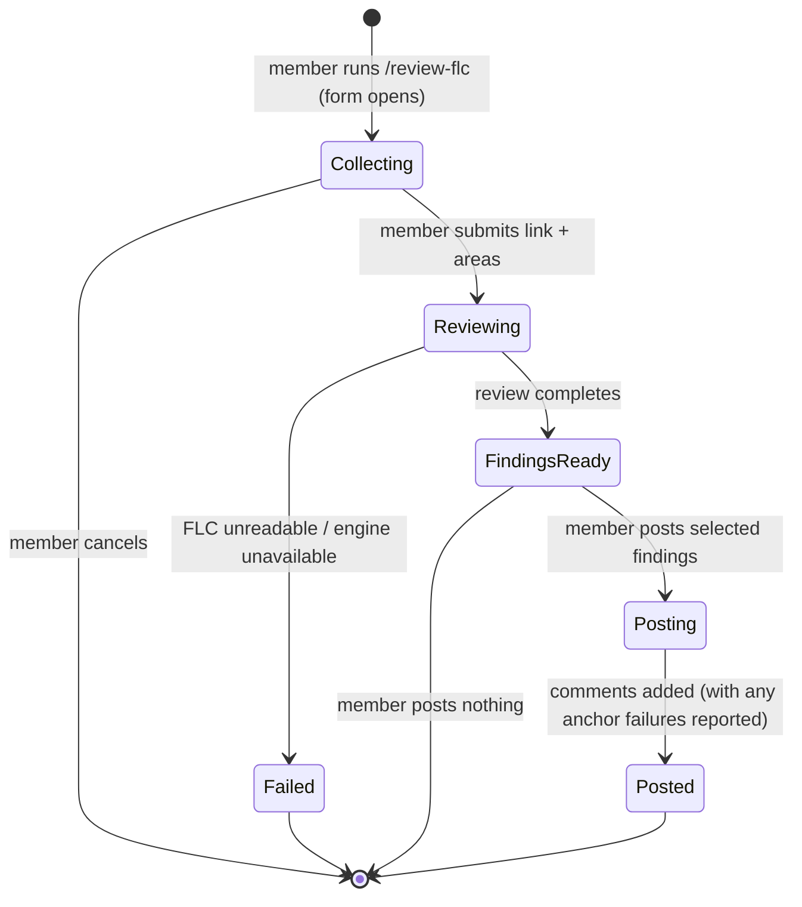

# 📝 FLC: `/review-flc` Slack Command

> **Page setup (apply on publish to Notion):** icon 📝 · set a cover/banner · add a `<table_of_contents color="gray"/>` block right after the header. This file is the local draft; Notion formatting (toggles, `<table>` blocks, rendered Mermaid) is applied when the page is created.

## Header

- **Feature name:** `/review-flc` Slack Command
- **Owner:** Danny
- **Team / Pod:** Functional
- **Document status:** Draft
- **Feature status:** Planned
- **Last updated:** 2026-06-29
- **Related links:**
  - Bot repo: `gantri-ai-bot`
  - Review standard (single source of truth): the Gantri FLC review checklist (`reviewing-flc-documents` skill / `feature-lifecycle-agent.md`)
  - Asana ticket: To be added
  - Slack app slash-commands config: To be added

**Sign-off**

| Section | Role | Name | Date |
|---------|------|------|------|
| Functional Specification | Product / Business | | |
| Technical Specification | Engineering | | |
| Testing Specification | QA / Engineering | | |
| Operational Specification | Engineering | | |
| Security & Access Control | Engineering | | |

---

## Functional Specification

### Overview

Team members who write FLCs cannot check their document against Gantri's FLC standard unless they have the reviewing tooling installed locally, which only one person has. As a result, FLC quality is inconsistent: most authors get no structured feedback before sharing a doc for sign-off, and the standard is applied unevenly across the team. This gap exists because the review logic lives in a local Claude Code skill that the rest of the team has no access to.

### Conceptual

**What it does:** `/review-flc` lets any team member, from any Slack conversation, point the bot at an FLC's Notion link and get back a structured review of that document graded against Gantri's FLC standard. The member chooses which areas to review, receives the issues grouped by severity, and can post any subset of those issues back onto the FLC as comments. The review reads the FLC and adds comments only — it never edits the document's content.

**Glossary:**

| Term | Definition |
|------|------------|
| **FLC** | A Feature Life Cycle document in Notion that scopes a feature before/while it is built. |
| **Reviewer (bot)** | The Slack bot identity that reads the FLC and, when asked, posts comments. |
| **Area** | A part of the FLC that can be reviewed independently: Functional, Technical, Testing, Operational, Security. |
| **Finding** | One issue the review surfaces: its severity, the section it refers to, the problem, and why it matters. |
| **Severity** | The priority of a finding: **Must Fix**, **Should Fix**, or **Suggestion**. |
| **Anchored comment** | A comment attached to the specific sentence/block of the FLC a finding refers to. |
| **Review standard** | The single canonical Gantri FLC checklist every review is graded against. |

<details>
<summary>**User Flow -- Review an FLC and post selected comments**</summary>

**Actor:** Team member (FLC author or reviewer)

1. The member runs `/review-flc` in any Slack channel or DM.
2. The bot opens a form asking for the FLC's Notion link and which areas to review; every area is pre-selected.
3. The member pastes the link, optionally deselects areas, and submits.
4. The bot acknowledges and posts a visible "reviewing…" status in the same conversation.
5. The bot reads the FLC and grades it against the review standard, limited to the selected areas.
6. The bot replaces the status with the findings, grouped by severity; each finding shows its section, the issue, and why it matters, and each is individually selectable.
7. The member ticks the findings worth posting and chooses "Post selected as comments".
8. The bot posts each selected finding as a comment anchored to the relevant part of the FLC, under the bot identity, and updates the message to show what was posted.
</details>

<details>
<summary>**User Flow -- Review only, no comments**</summary>

**Actor:** Team member

1. Steps 1–6 above.
2. The member reads the findings and posts nothing; the result stays in the conversation as a checklist they can act on themselves.
</details>

<details>
<summary>**Failure Path -- FLC cannot be read**</summary>

**Actor:** Team member

1. The member submits a link the reviewer cannot open (wrong URL, or the reviewer has not been granted access to the page).
2. The bot posts a clear error naming the likely cause (e.g., "I don't have access to this page — share it with the reviewer integration") and posts no findings and no comments.
</details>

<details>
<summary>**Failure Path -- Review engine unavailable**</summary>

**Actor:** Team member

1. The member submits a valid link but the review cannot be completed (the review engine is overloaded or times out).
2. The bot posts a clear, friendly error and posts nothing; the member can re-run the command to retry.
</details>

<details>
<summary>**Failure Path -- A finding cannot be anchored**</summary>

**Actor:** Team member

1. The member selects findings to post, but one finding's target text cannot be uniquely located in the FLC.
2. The bot posts the findings it can anchor, and the result message lists the ones it could not, so nothing is silently dropped.
</details>

**State Transitions:**



<details>
<summary>**Mockups & Screenshots**</summary>

**Figma source:** To be added — no UI design yet; the surface is a Slack modal + Block Kit result message.

**Screen inventory:**

| Screen | Description | Figma status |
|--------|-------------|--------------|
| Review form (modal) | FLC link field + area checkboxes (all pre-selected) | To be added |
| Findings message | Findings grouped by severity, each selectable, with a "Post selected as comments" action | To be added |
| Result update | Confirmation of which findings were posted / could not be anchored | To be added |
</details>

**Behavior descriptions:**

- **Default areas:** Every area is selected by default so the standard, full review is the default action; the member narrows only on purpose.
- **At least one area:** A review requires at least one area selected; submitting with none is rejected in the form.
- **Read-only on content:** A review never changes the FLC body. Its only write action is adding comments, and only the findings the member explicitly selects.
- **Consistency:** Every review for every member grades against the same canonical standard, so two people reviewing the same FLC get the same findings.

### Security & Access Control

| Role | Run a review | Post findings as comments |
|------|--------------|---------------------------|
| Unauthenticated user | No | No |
| Slack workspace member | Yes (any conversation) | Yes (selected findings only) |
| Reviewer (bot identity) | N/A — performs the review | Posts on behalf of the member, under the bot identity |

**Authentication requirements:** Every command invocation and interaction is verified as a genuine Slack request before it is processed. Reading the FLC and posting comments use a single workspace integration identity granted access to the FLC space.

**Data classifications:** FLC content is internal product/engineering documentation (Internal). No customer PII is expected. The requesting member's Slack user id and the FLC link are processed per request.

**Audit logging:**

| Action | Log level / prefix | Sample query | Retention |
|--------|--------------------|--------------|-----------|
| Review requested | info `[REVIEW-FLC]` | `[REVIEW-FLC] action:request user:U123 url:...` | Per bot log retention |
| Review completed | info `[REVIEW-FLC]` | `[REVIEW-FLC] action:complete findings:12` | Per bot log retention |
| Comments posted | info `[REVIEW-FLC]` | `[REVIEW-FLC] action:comment posted:5 failed:1` | Per bot log retention |
| Review failed | warn `[REVIEW-FLC]` | `[REVIEW-FLC] action:fail reason:no_access` | Per bot log retention |

**Retention and deletion policy:** The bot stores no FLC body beyond the request lifecycle (or a short-lived job record). Comments persist in Notion until a human deletes them. Result messages live in Slack under the workspace's normal retention.

**Rate limiting:** Maximum 5 reviews per member per 10 minutes; one in-flight review per member at a time. Comment posting is bounded by the number of findings in a single review.

**Threat considerations:**
- *Unauthorized page access:* the reviewer only sees pages explicitly shared with it; an unshared link returns an access error, never partial content.
- *Prompt injection from FLC content:* FLC text is treated as data to be reviewed, not instructions to the review engine.
- *Comment spam / wrong-page posting:* rate limits cap volume; the link is validated and findings post only to the reviewed page, only when the member selects them.

### Requirements

| ID | Requirement |
|----|-------------|
| R1 | A workspace member can start a review from any Slack channel or DM; access is not restricted by channel or role. |
| R2 | On invocation, the member is shown a form requesting the FLC's Notion link and the areas to review (Functional, Technical, Testing, Operational, Security), with every area pre-selected. |
| R3 | The member can deselect areas; submitting with zero areas selected is rejected. |
| R4 | After submission the request is acknowledged immediately and a visible "reviewing" status appears in the same conversation. |
| R5 | The system reads the linked FLC's current content and grades it against the canonical review standard, limited to the selected areas. |
| R6 | Findings are returned grouped by severity (Must Fix, Should Fix, Suggestion); each finding states its section, the issue, and why it matters. |
| R7 | Each finding is individually selectable in the result. |
| R8 | The member can post any subset of findings as comments on the FLC; unselected findings are not posted. |
| R9 | Each posted comment is attached to the FLC **block** the finding refers to (block-level anchoring; the public Notion API does not support text-range/inline anchoring). If the block cannot be matched, the comment is posted at the page level and the result says so. |
| R10 | Posted comments appear under the bot identity. |
| R11 | The result indicates which findings were posted and which could not be anchored; none are silently dropped. |
| R12 | If the FLC link is invalid or unreadable, a clear error naming the likely cause is returned and nothing is posted. |
| R13 | If the review cannot complete, a clear error is returned, nothing is posted, and the member can retry. |
| R14 | Every review grades against one canonical standard, sourced from a single definition, so results are consistent across members and FLCs. |
| R15 | A review never modifies FLC content; its only write action is adding selected comments. |

### Assumptions

| ID | Assumption (already true, not built here) |
|----|------------------------------------------|
| A1 | FLCs are authored in Notion and each has a shareable page link. |
| A2 | The bot runs in the workspace and can open forms and post messages in conversations where its commands are enabled. |
| A3 | A canonical FLC review standard already exists and can be supplied to the review engine. |
| A4 | The review engine the bot uses is already available to it. |

### Exclusions

| ID | Not doing | Why |
|----|-----------|-----|
| E1 | Editing or rewriting FLC content | Review-only; fixes stay with the author. |
| E2 | A "copy fix-prompt for your AI" action | Deferred; v1 is review + comments. |
| E3 | A separate `/fix-flc` command | The bot stays read-only on content. |
| E4 | Creating or scaffolding new FLCs | That is the creating-flc-documents flow, separate. |
| E5 | Posting to TestRail / Qase / Asana | Out of scope for this feature. |

---

## Technical Specification

### Architecture

The command follows the bot's existing per-command pattern (`gantri-ai-bot`, Node/TS, Slack Bolt + ExpressReceiver, deployed on Fly.io).

- **Command handler:** new `src/slack/review-flc-command.ts` exporting `registerReviewFlcCommand(app, deps)`, registered from `src/index.ts` in the `buildSlackApp(...).registerExtra` callback alongside the existing `/preview`, `/deploy`, `/e2e`, `/cron` commands. Because v1 is usable in any conversation, it does **not** use the `decideCommandChannel` gating that `/preview` and `/deploy` apply.
- **Slack surface:** slash command → `ack()` → open a modal (FLC URL input + area checkboxes, all pre-checked). Modal submit → `ack()` → post a "reviewing…" message, then run the review and edit that message with Block Kit `checkboxes` per finding + a "Post selected as comments" button (`app.action`).
- **Notion access (net-new):** a small connector under `src/connectors/notion/` that (a) resolves a page URL → page id, (b) fetches the page content as text/markdown for the review, and (c) creates anchored comments. Uses `@notionhq/client` (new dependency) and a `NOTION_API_TOKEN` read from the Supabase vault, mirroring how other secrets are loaded in `index.ts`.
- **Review engine:** reuse `src/llm/resilient-claude.ts` (`callClaudeWithResilience`, Sonnet 4.6 primary → Haiku fallback, retries + budget). The system prompt **is the existing `reviewing-flc-documents` skill** — its review checklist, Definition of Done, and comment voice/anchoring guidance — synced into the bot (see below). The FLC text + selected areas are the user content; the model returns structured JSON findings.
- **Findings → UI → comments:** structured findings drive both the selectable Block Kit list and the comment poster (each finding already carries its anchor + message).

### Data Model

v1 needs no new persisted tables — a review is a single request/response cycle. Optional (deferred): a `review_flc_runs` row (requester, url, areas, counts, timestamp) if we later want history/metrics. If a longer review ever needs the background `JobsRunner`, reuse the existing devops jobs table rather than adding one.

### API / Contract

**Slack:** one slash command (`/review-flc`), one modal view, one block action ("Post selected as comments").

**Notion (via connector):** fetch page content by id; create comment anchored to a target. Findings are exchanged internally as structured objects.

<details>
<summary>Structured finding shape (LLM output → UI → comment poster)</summary>

```json
{
  "findings": [
    {
      "id": "F1",
      "severity": "Must Fix | Should Fix | Suggestion",
      "area": "Functional | Technical | Testing | Operational | Security",
      "section": "e.g. Functional Spec › Conceptual",
      "anchor": "unique ~start…end snippet from the FLC to attach the comment to",
      "message": "the issue and why it matters, in reviewer voice"
    }
  ]
}
```
</details>

<details>
<summary>System prompt sourcing (the standard is duplicated into the repo)</summary>

The review standard is the content of the **`reviewing-flc-documents` skill**, **duplicated into the bot repo** at `src/prompts/flc-review-standard.md` and loaded as the system prompt. Committing it in the repo means the standard ships with the deploy and works for the whole team — no runtime dependency on the local `~/.claude/skills` path. The bot copy and the Claude Code skill are kept in sync by hand when the standard changes (a one-line note at the top of the file points back to the skill). Reusing the whole skill is a bonus: its "Posting Review Comments to Notion" section already defines the anchoring + voice rules the comment poster applies.
</details>

### Error Handling

| Failure | Behavior |
|---------|----------|
| Invalid / unparseable URL | Reject in the modal with an inline validation message; no review runs. |
| Page not shared with the reviewer | Friendly error naming the cause; nothing posted (R12). |
| Review engine exhausted/timeout | Friendly error; nothing posted; member can retry (R13). |
| Model returns malformed JSON | Retry once; if still malformed, report a generic failure rather than rendering garbage. |
| Comment anchor not unique / not found | Post the anchorable findings; list the failures in the result (R11). Reuse the anchor-refinement strategy (longer unique snippet → distinctive phrase). |

### Rollout & Rollback

- **Rollout strategy:** ship the handler, register `/review-flc` in the Slack app dashboard, add `NOTION_API_TOKEN` to the vault and share the FLC space with the reviewer integration. No feature flag — the command simply exists once registered.
- **Rollback plan:** unregister the command in the Slack dashboard and remove the `registerReviewFlcCommand` call; no data migration to reverse.
- **Migration / Backfill:** none.

### Security & Data

- **Security implementation:** Slack request signing verifies every interaction; the Notion integration token is vault-stored and scoped to read + comment on the FLC space; rate limit 5 reviews/member/10 min, one in-flight per member.
- **Data sensitivity:** Internal docs only; no FLC body persisted beyond the request; comments persist in Notion until a human removes them.

### Testing

- **Test strategy:** unit-test URL→page-id parsing, the area-filtering of the prompt, structured-findings parsing, and the anchor-refinement fallback. Integration-test the Notion fetch + comment-create against a scratch page. Smoke-test the live Slack round-trip in a DM before announcing.
- **Test fixtures / Setup:** a scratch Notion FLC page shared with the reviewer integration; a sample FLC with known defects to assert findings against.

### Known Tradeoffs

- **Read-only on content (no auto-fix).** Keeps the bot from clobbering docs and matches the reviewer discipline; cost is the author still has to apply fixes (mitigated later by the deferred fix-prompt, E2).
- **Comments under the bot identity, not the member's.** Simpler and honest about automation; cost is attribution reads as "bot" rather than the person.
- **No background job in v1.** A review is one LLM call (~15–40s) handled inline with a "reviewing…" placeholder; if reviews grow expensive we move to the existing `JobsRunner` poller.
- **Anchored comments are the riskiest piece.** The public Notion API only supports page-level and **block-level** comments (`parent.block_id`) — not text-range/inline anchoring. The bot maps each finding's anchor snippet to the block that contains it and comments on that block; if no block matches, it falls back to a page-level comment and reports it. This must be confirmed with a live smoke test (Phase H) since block-comment behavior is API-version-sensitive.

---

## Testing Specification

> Section pending — to be completed after Technical Specification approval.

### Automated Tests

> Section pending.

### Manual Verification

> Section pending — TestRail/Qase suite link, environment, and test data setup to be added.

#### Affected Areas

> Section pending.

#### Test Cases

> Section pending.

---

## Operational Specification

> Section pending — to be completed after Technical Specification approval. (Expected to cover: review success/failure counts, comment-post failures, LLM capacity errors, and the owner/escalation path.)

---

## Operational Expense

Low. Reuses the bot's existing command framework, the resilient Claude helper, and the vault secret pattern. Net-new cost is the Notion connector (read + comment) and the per-review LLM call (bounded by the rate limit). No new infrastructure.

---

## Related Work / Dependencies

- Notion read + comment integration for the bot — **Blocking** (no Notion access exists today)
- `reviewing-flc-documents` skill — **Required for launch** (its content is duplicated into the repo at `src/prompts/flc-review-standard.md` as the system prompt; kept in sync by hand)
- `creating-flc-documents` skill — **Related** (shares the same standard; consumes the fixes downstream)
- "Copy fix-prompt for your AI" action — **Follow-up** (deferred from v1, E2)

---

## Open Questions / Decision Log

**Q1:** Who can run the command?
> **Resolved (2026-06-29):** anyone, from any conversation — no channel/role gating (unlike `/deploy`). It is a validator meant for the whole team.

**Q2:** Does v1 post comments, or only return findings in Slack?
> **Resolved (2026-06-29):** v1 is review + post selected findings as comments. The fix-prompt action is deferred (E2).

**Q3:** Under whose identity do comments appear?
> **Resolved (2026-06-29):** under the bot identity.

**Q4:** How do we guarantee everyone reviews with the same logic?
> **Resolved (2026-06-29):** the content of the `reviewing-flc-documents` skill is **duplicated into the bot repo** at `src/prompts/flc-review-standard.md` and loaded as the system prompt, so the standard ships with the deploy and serves the whole team. The two copies are kept in sync by hand.

**Q5:** Does the Notion integration token need comment-write scope on the whole FLC space, or per page?
> **Open:** confirm whether the reviewer integration is shared at the space level or per FLC page.
